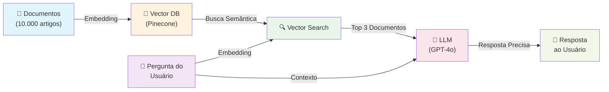
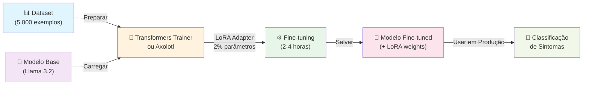
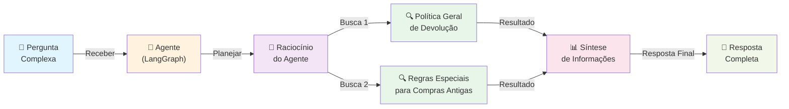
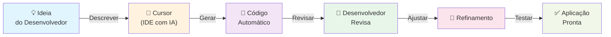
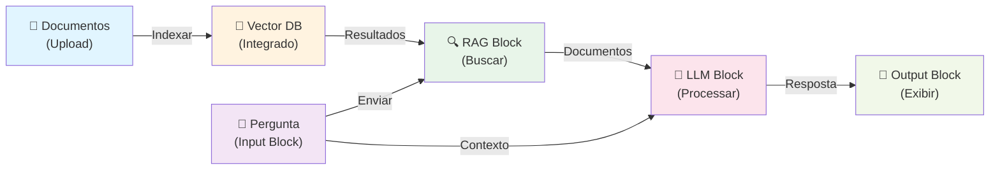
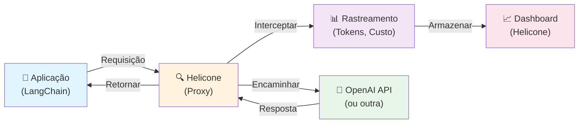

# fudAI-se

# 🤖 Soluções de IA - Conceitos, Ferramentas e Recursos

<div align="center">

[](https://openai.com) [](https://anthropic.com) [](https://deepmind.google/technologies/gemini/) [](https://ai.meta.com/llama/) [](https://mistral.ai) [](https://huggingface.co) [](https://www.deepseek.com/) [](https://www.alibabacloud.com/) [](https://stability.ai/) [](https://www.midjourney.com/) [](https://elevenlabs.io/) [](https://suno.ai/) [](https://langchain.com) [](https://www.llamaindex.ai/) [](https://github.com/microsoft/semantic-kernel) [](https://streamlit.io) [](https://fastapi.tiangolo.com) [](https://gradio.app/) [](https://chainlit.io/) [](https://microsoft.github.io/autogen/) [](https://github.com/stanfordnlp/dspy) [](https://langchain.com/langgraph) [](https://pytorch.org) [](https://www.tensorflow.org) [](https://scikit-learn.org/) [](https://pandas.pydata.org/) [](https://numpy.org/) [](https://opencv.org/) [](https://spacy.io/) [](https://jax.readthedocs.io/) [](https://www.pinecone.io) [](https://weaviate.io) [](https://qdrant.tech) [](https://milvus.io) [](https://neo4j.com) [](https://www.postgresql.org/) [](https://www.docker.com/) [](https://kubernetes.io/) [](https://www.ray.io/) [](https://cloud.google.com/vertex-ai) [](https://aws.amazon.com/sagemaker/) [](https://azure.microsoft.com/en-us/products/machine-learning/) [](https://groq.com/) [](https://runpod.io/) [](https://modal.com/) [](https://vercel.com/) [](https://www.python.org/) [](https://mermaid.js.org) [](https://www.datadoghq.com/) [](https://www.helicone.ai/) [](https://smith.langchain.com/) [](https://langfuse.com/) [](https://wandb.ai/) [](https://mlflow.org/) [](https://github.com/unslothai/unsloth) [](https://github.com/OpenAccess-AI-Collective/axolotl) [](https://www.perplexity.ai/) [](https://modelcontextprotocol.io/) [](https://tavily.com/) [](https://dify.ai/) [](https://ollama.com/) [](https://cursor.sh/) [](https://github.com/features/copilot) [](https://www.make.com/) [](https://n8n.io/) [](https://zapier.com/)

</div>

---

## 📚 SEÇÃO 1: CONCEITOS FUNDAMENTAIS DE IA

### **1.1 ARQUITETURAS E TIPOS DE MODELOS**

| **CONCEITO** | **DEFINIÇÃO** | **CARACTERÍSTICAS PRINCIPAIS** |
|---|---|---|
| **LLM - Large Language Model** | Modelo neural treinado em bilhões de tokens de texto que gera linguagem natural e entende prompts complexos | Parâmetros: 7B-405B; Treinado em dados até data de corte; Entende contexto; Gera texto coerente; Suporta múltiplas idiomas |
| **SLM - Small Language Model** | Versão compacta de LLM (1B-8B parâmetros) otimizada para rodar em dispositivos com poucos recursos | Tamanho: 1GB-8GB; Latência baixa (<100ms); Roda offline; Ideal para edge computing; Menor custo computacional |
| **VLM - Vision Language Model** | Modelo que processa simultaneamente texto, imagens e vídeos, entendendo contexto visual e textual | Processa múltiplas modalidades; Extrai informações de imagens; Entende relacionamentos visuais; Descreve cenas complexas |
| **MoE - Mixture of Experts** | Arquitetura de modelo onde diferentes "especialistas" processam diferentes partes da entrada | Escalabilidade; Eficiência; Modelos como Mixtral 8x7B; Reduz custo computacional |
| **Text-to-Image** | Modelo generativo que cria imagens a partir de descrições textuais detalhadas | Geração em tempo real; Múltiplos estilos; Controle fino; Resolução alta; Consistência visual |
| **Image-to-Text** | Modelo que descreve imagens em linguagem natural, extraindo informações visuais | Descrição detalhada; Identificação de objetos; Análise de cenas; Extração de texto em imagens |
| **Multimodal Learning** | Treinamento de modelos que processam múltiplas modalidades (texto, imagem, áudio) simultaneamente | Integração de modalidades; Compreensão holística; Contexto rico; Aplicações complexas |

### **1.2 TÉCNICAS E MÉTODOS (RAG & TRAINING)**

| **CONCEITO** | **DEFINIÇÃO** | **CARACTERÍSTICAS PRINCIPAIS** |
|---|---|---|
| **RAG - Retrieval-Augmented Generation** | Técnica que conecta um LLM a uma base de conhecimento externa, permitindo respostas com informações atualizadas | Busca documentos relevantes; Aumenta precisão; Reduz alucinações; Conhecimento específico do domínio; Atualização em tempo real |
| **Agentic RAG** | Evolução do RAG onde um agente decide autonomamente quando buscar, qual estratégia usar e como sintetizar | Planejamento inteligente; Múltiplas buscas coordenadas; Síntese de múltiplas fontes; Raciocínio sobre relevância |
| **GraphRAG** | Combina knowledge graphs com busca vetorial para entender relacionamentos entre entidades em grandes datasets | Mapeia relacionamentos; Identifica padrões globais; Análise de redes; Contexto estruturado; Consultas semânticas |
| **Fine-tuning** | Processo de treinar um modelo pré-treinado com dados específicos do domínio para melhorar performance | Adapta modelo genérico; Melhora precisão em tarefas específicas; Requer 100-10.000 exemplos; Mantém conhecimento geral |
| **LoRA - Low-Rank Adaptation** | Técnica de fine-tuning eficiente que treina apenas matrizes de baixa dimensionalidade | Reduz parâmetros treináveis em 99%; Economia de memória; Treinamento 10x mais rápido; Mantém qualidade |
| **Quantization** | Processo de reduzir precisão numérica de um modelo para diminuir tamanho e aumentar velocidade | Reduz tamanho em 75%; Aumenta velocidade em 4x; Mínima perda de qualidade; Ideal para edge computing |
| **RLHF - Reinforcement Learning from Human Feedback** | Técnica de alinhar modelo com preferências humanas usando feedback de classificação | Melhora qualidade de respostas; Reduz respostas indesejadas; Alinha com valores humanos; Usado em GPT-4, Claude |
| **Transfer Learning** | Técnica de usar conhecimento de um modelo treinado em uma tarefa para melhorar performance em outra | Reutilização de conhecimento; Reduz tempo de treinamento; Melhora com poucos dados; Eficiência computacional |
| **Tool Use / Function Calling** | Capacidade do modelo chamar funções externas (APIs, código) para completar tarefas | Integração com sistemas externos; Execução de ações; Acesso a dados em tempo real; Automação de workflows |

### **1.3 ENGENHARIA DE PROMPTS E INFERÊNCIA**

| **CONCEITO** | **DEFINIÇÃO** | **CARACTERÍSTICAS PRINCIPAIS** |
|---|---|---|
| **Prompt Engineering** | Arte de formular prompts eficazes para extrair melhor performance dos modelos | Estrutura clara; Exemplos (few-shot); Instruções explícitas; Contexto relevante; Iteração e refinamento |
| **Chain-of-Thought (CoT)** | Técnica onde o modelo mostra seu raciocínio passo a passo antes de dar resposta final | Melhora acurácia; Raciocínio transparente; Reduz erros em problemas complexos; Permite verificação humana |
| **Few-Shot Learning** | Técnica de fornecer poucos exemplos no prompt para o modelo aprender padrão rapidamente | 2-5 exemplos suficientes; Sem treinamento adicional; Adaptação rápida; Economia de tokens |
| **Zero-Shot Learning** | Modelo consegue executar tarefa sem exemplos prévios, apenas com instrução textual | Sem exemplos; Generalização; Flexibilidade; Aplicável a tarefas novas |
| **Temperature** | Parâmetro que controla criatividade vs. determinismo nas respostas do modelo | 0 = determinístico; 1 = criativo; Ajusta aleatoriedade; Importante para diferentes casos de uso |
| **Top-K e Top-P Sampling** | Técnicas de controle de diversidade nas respostas geradas pelo modelo | Top-K: seleciona K tokens mais prováveis; Top-P: seleciona tokens até probabilidade P; Reduz respostas absurdas |
| **Speculative Decoding** | Técnica que usa um modelo pequeno para "rascunhar" tokens que são verificados por um modelo maior | Aumenta velocidade em 2-3x; Mantém qualidade do modelo maior; Requer dois modelos |

### **1.4 INFRAESTRUTURA E MÉTRICAS**

| **CONCEITO** | **DEFINIÇÃO** | **CARACTERÍSTICAS PRINCIPAIS** |
|---|---|---|
| **Token** | Unidade básica de processamento em LLMs, pode ser palavra, subpalavra ou caractere | Contagem de tokens determina custo; Limite de contexto; Importante para otimização; ~4 caracteres = 1 token |
| **Context Window** | Quantidade máxima de tokens que um modelo consegue processar em uma requisição | Varia de 4K a 200K tokens; Maior contexto = mais informação; Afeta custo; Importante para RAG |
| **TTFT - Time to First Token** | Métrica que mede o tempo entre o envio do prompt e o recebimento do primeiro token da resposta | Crítico para UX; Menor é melhor; Afetado por latência de rede e prefill |
| **TPS - Tokens Per Second** | Velocidade de geração do modelo, medindo quantos tokens são gerados por segundo | Importante para leitura humana (>50 TPS ideal); Afeta custo e tempo total |
| **KV Cache** | Técnica de otimização que armazena cálculos de atenção passados para acelerar a geração | Reduz computação repetitiva; Aumenta velocidade de inferência; Consome VRAM |
| **Batch Processing** | Modo de processar grandes volumes de requisições com preço reduzido e latência maior | Economia de 50-80%; Processamento overnight; Ideal para volumes altos; Sem limite de requisições |
| **Streaming / Real-time Processing** | Processamento de dados em tempo real, ideal para aplicações que precisam de latência baixa | Latência <1s; Resposta imediata; Ideal para chatbots; Processamento contínuo de dados |
| **Hallucination** | Fenômeno onde modelo gera informações plausíveis mas incorretas ou fabricadas | Problema comum em LLMs; Reduzido com RAG; Mitigado com fact-checking; Importante em aplicações críticas |

### **1.5 DOMÍNIOS E BUSCA**

| **CONCEITO** | **DEFINIÇÃO** | **CARACTERÍSTICAS PRINCIPAIS** |
|---|---|---|
| **NLP - Natural Language Processing** | Campo de IA focado em compreensão e geração de linguagem natural | Análise de sentimento; Extração de entidades; Classificação de texto; Tradução; Sumarização |
| **Computer Vision (CV)** | Campo de IA focado em análise e compreensão de imagens e vídeos | Detecção de objetos; Segmentação; Reconhecimento facial; Análise de cenas; Rastreamento de movimento |
| **OCR - Optical Character Recognition** | Tecnologia que extrai texto de imagens ou documentos escaneados | Reconhecimento de caracteres; Preservação de layout; Suporte a múltiplos idiomas; Detecção de tabelas |
| **ASR - Automatic Speech Recognition** | Tecnologia que converte áudio falado em texto com alta precisão | Reconhecimento de fala; Suporte multilíngue; Detecção de emoção; Identificação de falante |
| **TTS - Text-to-Speech** | Tecnologia que converte texto em áudio falado natural e expressivo | Síntese de voz natural; Múltiplas vozes; Controle de entonação; Suporte multilíngue; Latência baixa |
| **Embeddings** | Representação numérica (vetor) que captura o significado semântico de texto, imagem ou áudio | Dimensionalidade: 384-1536; Captura significado; Permite busca semântica; Compressão de informação; Comparação de similaridade |
| **Vector Search** | Busca por similaridade em espaço vetorial, encontrando itens semanticamente similares | Busca por significado (não por palavra-chave); Tolerância a variações; Rápida em grandes volumes; Baseada em distância euclidiana ou cosseno |
| **Semantic Search** | Busca que entende significado, não apenas palavras-chave | Busca por conceito; Tolerância a variações; Resultados mais relevantes; Baseada em embeddings |
| **Knowledge Graph** | Representação estruturada de conhecimento como rede de entidades e relacionamentos | Mapeia relacionamentos; Consultas estruturadas; Raciocínio lógico; Detecção de padrões |
| **Retrieval Ranking / Reranking** | Técnica de reordenar resultados de busca usando modelos especializados para melhorar relevância | Melhora precisão em 20-40%; Usa cross-encoders; Refina resultados de busca vetorial; Essencial para RAG |
| **Query Rewriting** | Técnica de reformular queries do usuário para melhorar busca em RAG | Expande queries; Corrige erros de digitação; Melhora relevância; Reduz alucinações |

---

## 🛠️ SEÇÃO 2: FERRAMENTAS E FRAMEWORKS (EXPANDIDA)

### **2.1 FRAMEWORKS**

| **FRAMEWORK** | **O QUE FAZ** | **QUANDO USAR** |
|---|---|---|
| **LangChain** | Simplifica construção de aplicações com LLMs, abstraindo complexidade | Qualquer aplicação com LLM; RAG; Chains; Agents |
| **LangGraph** | Extensão de LangChain para construir agentes com controle explícito via state machines | Agentes complexos; Workflows com múltiplas etapas; Debugging detalhado |
| **DSPy** | Framework para otimizar prompts programaticamente, tratando prompts como parâmetros otimizáveis | Pipelines complexos; Otimização automática de prompts; Substitui engenharia manual de prompts |
| **AutoGen** | Framework Microsoft para multi-agent systems onde agentes conversam entre si | Sistemas multi-agente; Colaboração entre agentes; Tarefas complexas |
| **LlamaIndex** | Framework para construir aplicações RAG com indexação inteligente | RAG; Indexação de documentos; Busca semântica |
| **Streamlit** | Cria aplicações web interativas com Python em minutos | Prototipagem rápida; Dashboards; Demos; Interfaces simples |
| **Gradio** | Cria interfaces web para modelos de ML rapidamente | Demos de modelos; Interfaces simples; Compartilhamento rápido |
| **FastAPI** | Framework web moderno para construir APIs rápidas e eficientes | APIs de produção; Microserviços; Alta performance |
| **TensorFlow** | Framework de deep learning do Google para pesquisa e produção | Deep learning; Pesquisa; Produção; Modelos complexos |
| **PyTorch** | Framework de deep learning do Meta, preferido em pesquisa | Pesquisa; Prototipagem; Flexibilidade; Comunidade ativa |
| **JAX** | Framework de computação numérica com diferenciação automática | Pesquisa avançada; Computação de alto desempenho; Flexibilidade |

---

### **2.2 BIBLIOTECAS**

| **BIBLIOTECA** | **O QUE FAZ** | **QUANDO USAR** |
|---|---|---|
| **Hugging Face Transformers** | Acesso a milhares de modelos pré-treinados de NLP e CV | Fine-tuning; Uso de modelos open-source; Pesquisa |
| **spaCy** | Biblioteca de NLP otimizada para produção com pipelines eficientes | Processamento de texto; Extração de entidades; Análise linguística |
| **OpenCV** | Biblioteca de visão computacional com funções para processamento de imagem e vídeo | Processamento de imagem; Manipulação de vídeo; Transformações |
| **Scikit-learn** | Biblioteca de ML clássico com algoritmos tradicionais | ML tradicional; Classificação; Regressão; Clustering |
| **Pandas** | Biblioteca para manipulação e análise de dados estruturados | Processamento de dados; Análise; Transformação |
| **NumPy** | Biblioteca para computação numérica e operações em arrays | Cálculos numéricos; Operações matriciais; Base para outras libs |
| **Matplotlib / Seaborn** | Bibliotecas para visualização de dados e gráficos | Visualização; Análise exploratória; Relatórios |
| **Plotly** | Biblioteca para visualizações interativas e dashboards | Dashboards interativos; Visualizações web; Exploração de dados |

---

### **2.3 ENGINES**

| **ENGINE** | **O QUE FAZ** | **QUANDO USAR** |
|---|---|---|
| **YOLO** | Detecção de objetos em tempo real com alta velocidade | Detecção de objetos; Vigilância; Análise de vídeo |
| **Detectron2** | Detecção e segmentação de objetos avançada (Facebook) | Segmentação de instâncias; Detecção complexa; Pesquisa |
| **Tesseract** | Engine open-source para OCR com suporte a 100+ idiomas | Extração de texto de imagens; Documentos escaneados; Baixo custo |
| **vLLM** | Engine otimizado para serving de LLMs com alta throughput | Serving de modelos; Alta performance; Batching eficiente |
| **TGI - Text Generation Inference** | Engine Hugging Face para serving de LLMs em produção | Serving de modelos; Otimizado para produção; Suporte a múltiplos modelos |

---

### **2.4 PLATAFORMAS**

| **PLATAFORMA** | **O QUE FAZ** | **QUANDO USAR** |
|---|---|---|
| **Dify** | Construir aplicações de IA sem escrever código, com interface visual | Não-técnicos; Prototipagem rápida; Chatbots; Workflows simples |
| **Ollama** | Rodar modelos LLM localmente de forma simples | Modelos offline; Privacidade; Desenvolvimento local; Sem API |
| **LangSmith** | Rastrear, debugar e monitorar aplicações LLM | Debugging; Observabilidade; Otimização de prompts |
| **Langfuse** | Observabilidade open-source para aplicações LLM | Rastreamento; Analytics; Debugging; Alternativa a LangSmith |
| **Weights & Biases (W&B)** | Rastreamento de experimentos de ML e monitoramento | Treinamento de modelos; Experimentos; Comparação de resultados |
| **MLflow** | Gerenciar ciclo de vida de ML (versionamento, tracking, deployment) | Versionamento de modelos; Rastreamento de experimentos; Deployment |
| **Prompt Flow** | Construir e testar workflows com LLMs (Microsoft) | Desenvolvimento de prompts; Workflows; Testes |
| **Semantic Kernel** | Integrar LLMs em aplicações .NET (Microsoft) | Integração com C#/.NET; Plugins; Orquestração |

---

### **2.5 FRAMEWORKS DE FINE-TUNING**

| **FRAMEWORK** | **TIPO** | **O QUE FAZ** | **QUANDO USAR** |
|---|---|---|---|
| **Transformers Trainer** | Open-source | Framework padrão para fine-tuning de modelos Hugging Face | Fine-tuning de LLMs; Mais utilizado na comunidade |
| **Axolotl** | Open-source | Framework simplificado para fine-tuning de LLMs com configuração YAML | Fine-tuning rápido; Configuração simples; Muito utilizado |
| **TRL (Transformer Reinforcement Learning)** | Open-source | Framework para RLHF e fine-tuning com reforço | Fine-tuning com feedback humano; Alinhamento de modelos |
| **Unsloth** | Open-source | Framework otimizado para fine-tuning rápido e eficiente | Fine-tuning 2-5x mais rápido; Economia de memória; Crescimento rápido |
| **Torchtune** | Open-source | Framework Meta para fine-tuning de modelos Llama | Fine-tuning de Llama; Otimizado; Muito utilizado |

---

### **2.6 ORQUESTRADORES**

| **ORQUESTRADOR** | **O QUE FAZ** | **QUANDO USAR** |
|---|---|---|
| **Kubernetes** | Orquestração de containers em escala para produção | Deployment em escala; Alta disponibilidade; Gerenciamento de recursos |
| **Airflow** | Orquestração de workflows de dados complexos | Pipelines de dados; Agendamento; Monitoramento |
| **Prefect** | Alternativa moderna a Airflow para orquestração de workflows | Pipelines de dados; Workflows complexos; Melhor UX que Airflow |

---

### **2.7 PLATAFORMAS NO-CODE / LOW-CODE**

| **PLATAFORMA** | **O QUE FAZ** | **QUANDO USAR** |
|---|---|---|
| **Dify** | Construir aplicações de IA sem escrever código, com interface visual | Não-técnicos; Prototipagem rápida; Chatbots; Workflows simples |
| **Make (Integromat)** | Automação de workflows sem código | Integração de sistemas; Automação de processos; Muito utilizado |
| **Zapier** | Automação e integração de aplicações sem código | Conectar apps; Automação de tarefas; Muito utilizado |
| **n8n** | Automação open-source de workflows | Open-source; Automação complexa; Self-hosted; Alternativa a Make |
| **Bubble** | Construir aplicações web sem código | Aplicações web completas; Prototipagem rápida; Muito utilizado |
| **FlutterFlow** | Construir apps mobile sem código | Apps mobile; UI/UX visual; Muito utilizado |

---

### **2.8 PLATAFORMAS VIBECODING**

| **PLATAFORMA** | **O QUE FAZ** | **QUANDO USAR** |
|---|---|---|
| **Cursor** | IDE com IA integrada para desenvolvimento assistido | Desenvolvimento rápido; Pair programming com IA; Muito utilizado |
| **GitHub Copilot** | Autocompletar de código com IA | Desenvolvimento; Sugestões de código; Muito utilizado |
| **Windsurf** | IDE com IA para desenvolvimento assistido | Desenvolvimento rápido; Alternativa a Cursor; Crescimento rápido |
| **Cline** | Agente de IA para desenvolvimento | Desenvolvimento autônomo; Criação de projetos; Open-source |
| **Claude for VSCode** | Extensão Claude no VSCode | Desenvolvimento com Claude; Integração VSCode; Muito utilizado |
| **Aider** | CLI para desenvolvimento assistido por IA | Desenvolvimento via terminal; Pair programming; Open-source |

---

### **2.9 PLATAFORMAS DE DEPLOYMENT**

| **PLATAFORMA** | **O QUE FAZ** | **QUANDO USAR** |
|---|---|---|
| **Docker** | Containerização de aplicações para deployment consistente | Deployment; Escalabilidade; Reprodutibilidade |
| **Ray** | Framework distribuído para processamento paralelo e ML em escala | Processamento paralelo; Treinamento distribuído; Serving em escala |
| **Vertex AI** | Plataforma Google para construir, treinar e deployar modelos de ML | ML end-to-end; AutoML; Modelos Google; Integração com GCP |
| **SageMaker** | Plataforma AWS para ML com ferramentas completas de desenvolvimento | ML end-to-end; Treinamento; Deployment; Integração com AWS |
| **Azure ML** | Plataforma Microsoft para ML com integração com ecossistema Azure | ML end-to-end; Integração Azure; MLOps; Governance |
| **Modal** | Plataforma serverless para rodar código Python em GPU | Deployment rápido; Escalável; Sem gerenciar infraestrutura |
| **Runpod** | Plataforma para rodar workloads em GPU com preço competitivo | GPU acessível; Treinamento; Inference; Preço baixo |

---

### **2.10 FERRAMENTAS DE AVALIAÇÃO E TESTING**

| **FERRAMENTA** | **O QUE FAZ** | **QUANDO USAR** |
|---|---|---|
| **RAGAS** | Framework para avaliar qualidade de sistemas RAG | Avaliar RAG; Métricas de relevância; Muito utilizado |
| **DeepEval** | Framework para avaliar qualidade de LLMs | Testes de LLM; Métricas customizadas; Integração com CI/CD |
| **Braintrust** | Plataforma para avaliar e comparar LLMs | Comparação de modelos; A/B testing; Análise de performance |

---

### **2.11 FERRAMENTAS DE PROCESSAMENTO DE DADOS**

| **FERRAMENTA** | **O QUE FAZ** | **QUANDO USAR** |
|---|---|---|
| **Airbyte** | Plataforma open-source para ETL/ELT | Integração de dados; Pipelines de dados; Muito utilizado |
| **dbt** | Ferramenta para transformação de dados em data warehouses | Transformação de dados; Data modeling; Muito utilizado |
| **Label Studio** | Plataforma open-source para data labeling | Criar datasets; Anotação de dados; Fine-tuning |

---

### **2.12 FERRAMENTAS DE MONITORAMENTO DE CUSTOS**

| **FERRAMENTA** | **O QUE FAZ** | **QUANDO USAR** |
|---|---|---|
| **Helicone** | Plataforma para rastrear gastos com APIs de LLM | Monitoramento de custos; Analytics; Otimização de gastos |
| **Lithic** | Plataforma para monitoramento de uso de APIs | Rastreamento de uso; Alertas; Análise de custos |

---

## 🌐 SEÇÃO 3: RECURSOS, SERVIÇOS E APIs (EXPANDIDA)

### **3.1 MODELOS LLM (OPEN-SOURCE - MAIS UTILIZADOS)**

| **MODELO** | **PROVEDOR** | **CARACTERÍSTICAS** |
|---|---|---|
| **Llama 3.2, Llama 3.1, Llama 2** | Meta | Open-source; 1B-405B parâmetros; Mais utilizado em produção; Roda localmente |
| **Mistral 7B, Mixtral 8x7B** | Mistral AI | Open-source; Eficiente; Muito usado em produção; Excelente custo-benefício |
| **Qwen 2.5** | Alibaba | Open-source; Múltiplos tamanhos; Muito utilizado na Ásia; Crescimento rápido |
| **DeepSeek-V3** | DeepSeek | Open-source; Excelente raciocínio; Custo-benefício superior; Crescimento exponencial |

---

### **3.2 MODELOS LLM (PROPRIETÁRIOS - MAIS UTILIZADOS)**

| **MODELO** | **PROVEDOR** | **CARACTERÍSTICAS** |
|---|---|---|
| **GPT-4o, GPT-4 Turbo, GPT-3.5 Turbo** | OpenAI | Mais utilizado em produção; 128K tokens; Visão; Conhecimento até Abril 2024 |
| **Claude 3.5 Sonnet, Claude 3 Opus** | Anthropic | Excelente raciocínio; 200K tokens; Muito usado em análise; Conhecimento até Abril 2024 |
| **Gemini 2.0 Flash, Gemini 1.5 Pro** | Google | Multimodal; 1M tokens; Análise de vídeos; Integração com Google |

---

### **3.3 MODELOS DE EMBEDDING - MAIS UTILIZADOS**

| **MODELO** | **PROVEDOR** | **CARACTERÍSTICAS** |
|---|---|---|
| **text-embedding-3-large** | OpenAI | Mais utilizado; 3072 dimensões; Qualidade superior; Muito preciso |
| **text-embedding-3-small** | OpenAI | Versão rápida; 1536 dimensões; Bom custo-benefício |
| **nomic-embed-text** | Nomic AI | Open-source; 768 dimensões; Muito utilizado; Alternativa gratuita |
| **bge-large-en-v1.5** | BAAI | Open-source; 1024 dimensões; Excelente performance; Comunidade ativa |

---

### **3.4 MODELOS DE RERANKING - MAIS UTILIZADOS**

| **MODELO** | **PROVEDOR** | **CARACTERÍSTICAS** |
|---|---|---|
| **bge-reranker-large** | BAAI | Open-source; Muito utilizado; Melhora precisão em 20-40%; Roda localmente |
| **cross-encoder/ms-marco-MiniLM-L-12-v2** | Sentence Transformers | Open-source; Rápido; Bom custo-benefício; Muito utilizado |

---

### **3.5 MODELOS DE CÓDIGO - MAIS UTILIZADOS**

| **MODELO** | **PROVEDOR** | **CARACTERÍSTICAS** |
|---|---|---|
| **CodeLlama** | Meta | Open-source; Especializado em código; Muito utilizado; Roda localmente |
| **Deepseek-Coder** | DeepSeek | Open-source; Excelente em código; Crescimento rápido; Muito preciso |

---

### **3.6 MODELOS VISION (VLM) - MAIS UTILIZADOS**

| **MODELO** | **PROVEDOR** | **CARACTERÍSTICAS** |
|---|---|---|
| **GPT-4o Vision** | OpenAI | Mais utilizado; Análise de imagens; Extração de texto; Descrição de cenas |
| **Claude Vision** | Anthropic | Análise detalhada; Extração de informações; Suporte a múltiplos formatos |
| **Gemini Vision** | Google | Análise de imagens; Análise de vídeos; Extração de texto |
| **LLaVA** | Open-source | Open-source; Roda localmente; Alternativa gratuita; Comunidade ativa |

---

### **3.7 MODELOS TEXT-TO-IMAGE - MAIS UTILIZADOS**

| **MODELO** | **PROVEDOR** | **CARACTERÍSTICAS** |
|---|---|---|
| **DALL-E 3** | OpenAI | Mais utilizado em produção; Qualidade alta; Múltiplos estilos |
| **Stable Diffusion 3** | Stability AI | Open-source; Roda localmente; Muito utilizado; Comunidade grande |
| **Midjourney** | Midjourney | Qualidade artística; Comunidade ativa; Interface Discord; Muito usado |

---

### **3.8 MODELOS ASR (SPEECH-TO-TEXT) - MAIS UTILIZADOS**

| **MODELO** | **PROVEDOR** | **CARACTERÍSTICAS** |
|---|---|---|
| **Whisper** | OpenAI | Open-source; Mais utilizado; Múltiplos idiomas; Robusto a ruído; Roda localmente |
| **Google Speech-to-Text** | Google | Muito utilizado em produção; Múltiplos idiomas; Detecção de emoção |

---

### **3.9 MODELOS TTS (TEXT-TO-SPEECH) - MAIS UTILIZADOS**

| **MODELO** | **PROVEDOR** | **CARACTERÍSTICAS** |
|---|---|---|
| **OpenAI TTS** | OpenAI | Muito utilizado; Múltiplas vozes; Latência baixa; Qualidade natural |
| **ElevenLabs** | ElevenLabs | Vozes mais realistas; Muito usado em produção; Múltiplos idiomas |
| **Bark** | Suno AI | Open-source; Roda localmente; Alternativa gratuita; Qualidade boa |

---

### **3.10 VECTOR DATABASES - MAIS UTILIZADOS**

| **BANCO** | **TIPO** | **CARACTERÍSTICAS** |
|---|---|---|
| **Pinecone** | SaaS | Mais utilizado em produção; Gerenciado; Escalável; Sem ops |
| **Weaviate** | Open-source / SaaS | Open-source; Muito utilizado; Customizável; Suporte a múltiplos modelos |
| **Milvus** | Open-source | Open-source; Escalável; Muito usado em China/Ásia; Comunidade ativa |
| **Qdrant** | Open-source / SaaS | Open-source; Rápido; Filtros avançados; Crescimento rápido |
| **PostgreSQL + pgvector** | Open-source | Open-source; Muito utilizado; Integração com banco relacional; Custo baixo |

---

### **3.11 BANCOS DE DADOS DE GRAFOS - MAIS UTILIZADOS**

| **BANCO** | **TIPO** | **CARACTERÍSTICAS** |
|---|---|---|
| **Neo4j** | SaaS / Open-source | Mais utilizado para GraphRAG; Consultas poderosas; Comunidade ativa |

---

### **3.12 SERVIÇOS DE BUSCA - MAIS UTILIZADOS**

| **SERVIÇO** | **O QUE FAZ** | **CARACTERÍSTICAS** |
|---|---|---|
| **Perplexity API** | Busca com IA em tempo real | Busca em tempo real; Citações; Respostas estruturadas |
| **Tavily Search API** | Busca otimizada para agentes | Busca relevante; Muito usada em agentes; Integrada com LangChain |
| **Serper API** | Busca do Google para agentes | Busca Google; Rápida; Confiável; Muito utilizada |

---

### **3.13 SERVIÇOS DE FINE-TUNING - MAIS UTILIZADOS**

| **SERVIÇO** | **PROVEDOR** | **CARACTERÍSTICAS** |
|---|---|---|
| **OpenAI Fine-tuning API** | OpenAI | Mais utilizado; Simples; Rápido; Suporte técnico |
| **Anthropic Fine-tuning** | Anthropic | Muito utilizado; Qualidade; Suporte; Customização |

---

### **3.14 PLATAFORMAS DE OBSERVABILITY - MAIS UTILIZADAS**

| **PLATAFORMA** | **O QUE FAZ** | **CARACTERÍSTICAS** |
|---|---|---|
| **LangSmith** | Rastreamento e debugging de LLMs | Rastreamento completo; Debugging; Otimização de prompts; Muito utilizado |
| **Langfuse** | Observabilidade open-source para LLMs | Open-source; Rastreamento; Analytics; Alternativa a LangSmith |
| **Datadog** | Monitoramento e observabilidade | Monitoramento completo; Alertas; Integração com tudo; Muito utilizado |

---

### **3.15 REPOSITÓRIOS E HUBS DE MODELOS - MAIS UTILIZADOS**

| **REPOSITÓRIO** | **O QUE OFERECE** | **CARACTERÍSTICAS** |
|---|---|---|
| **Hugging Face Hub** | Repositório de modelos open-source | 500K+ modelos; Datasets; Spaces; Comunidade; Mais utilizado |
| **OpenRouter** | Agregador de modelos | Acesso a múltiplos modelos via API unificada; Muito utilizado |

---

### **3.16 SERVIÇOS DE MODELOS (MODEL SERVING) - MAIS UTILIZADOS**

| **SERVIÇO** | **O QUE FAZ** | **CARACTERÍSTICAS** |
|---|---|---|
| **Replicate** | Rodar modelos open-source via API | Sem gerenciar infraestrutura; Preço por uso; Muito utilizado |
| **Together AI** | Rodar modelos open-source | Modelos open-source; Preço competitivo; Muito utilizado |
| **Groq** | Hardware especializado para LLMs rápidos | Muito rápido; Latência baixa; Crescimento rápido |
| **Hugging Face Spaces** | Hospedar e compartilhar modelos | Hosting de modelos; Demos; Colaboração; Gratuito; Muito utilizado |

---

## 📖 SEÇÃO 4: EXEMPLOS PRÁTICOS DETALHADOS COM ARQUITETURA

Agora vou detalhar cada conceito/ferramenta com **exemplos práticos reais** e **diagramas Mermaid** mostrando a arquitetura.

---

### **EXEMPLO 1: RAG - Retrieval-Augmented Generation**

**Caso de Uso Real:** Empresa tem 10.000 artigos de suporte e quer chatbot que responda com precisão.

**Problema:**

- LLM genérico não conhece produtos específicos
- Respostas genéricas e imprecisas
- Clientes ficam insatisfeitos

**Solução com RAG:**

```
1. Cliente pergunta: "Como resetar minha senha?"
2. Sistema busca na base de conhecimento
3. Encontra: "Artigo #234: Resetar senha em 3 passos"
4. LLM lê artigo + pergunta
5. Responde com instruções precisas do seu produto
```

**Snippet de Código (Python + LangChain):**

```python
from langchain_openai import ChatOpenAI, OpenAIEmbeddings
from langchain_community.vectorstores import FAISS
from langchain_core.prompts import ChatPromptTemplate
from langchain_core.runnables import RunnablePassthrough

# Setup
model = ChatOpenAI(model="gpt-4o")
vectorstore = FAISS.from_texts(
    ["Artigo #234: Para resetar a senha, acesse configurações > segurança."], 
    embedding=OpenAIEmbeddings()
)
retriever = vectorstore.as_retriever()

# RAG Chain
template = "Responda com base no contexto: {context}\nPergunta: {question}"
prompt = ChatPromptTemplate.from_template(template)
chain = (
    {"context": retriever, "question": RunnablePassthrough()}
    | prompt
    | model
)

# Execução
print(chain.invoke("Como reseto a senha?").content)
```

**Arquitetura RAG:**



**Como usar:**

1. **Preparar documentos:**
   - Coletar 10.000 artigos de suporte
   - Dividir em chunks de 500 tokens
   - Gerar embeddings com `text-embedding-3-large`

2. **Indexar em Vector Database:**
   - Usar Pinecone ou Weaviate
   - Armazenar embeddings + metadados
   - Criar índices para busca rápida

3. **Quando pergunta chega:**
   - Converter pergunta em embedding
   - Buscar top 3 documentos similares
   - Passar documentos + pergunta para LLM
   - LLM sintetiza resposta com informações do seu negócio

4. **Melhorias com Reranking:**
   - Usar `bge-reranker-large` para reordenar resultados
   - Melhora precisão em 20-40%
   - Reduz alucinações

5. **Melhorias com Query Rewriting:**
   - Reformular pergunta do usuário
   - Expandir queries
   - Corrigir erros de digitação

**Ferramentas necessárias:**

- **LangChain** ou **LlamaIndex** (orquestração)
- **Pinecone** ou **Weaviate** (vector database)
- **OpenAI API** (embeddings + LLM)
- **LangSmith** (observabilidade)

**Benefício:** Respostas precisas, reduz alucinações, conhecimento sempre atualizado.

---

### **EXEMPLO 2: Fine-tuning com LoRA**

**Caso de Uso Real:** Clínica médica quer modelo que classifique sintomas com precisão médica.

**Problema:**

- GPT genérico confunde sintomas
- Resposta: "Pode ser gripe ou COVID"
- Não é confiável para diagnóstico

**Solução com Fine-tuning:**

```
1. Coletar 5.000 exemplos de sintomas + diagnósticos corretos
2. Treinar modelo com LoRA (eficiente)
3. Modelo aprende padrões específicos da clínica
4. Resposta: "Baseado em seus sintomas e histórico, 
   probabilidade 85% de bronquite viral"
```

**Snippet de Código (Python + Unsloth):**

```python
from unsloth import FastLanguageModel
from trl import SFTTrainer
from transformers import TrainingArguments

# 1. Carregar Modelo + LoRA
model, tokenizer = FastLanguageModel.from_pretrained(
    model_name = "unsloth/llama-3-8b-bnb-4bit",
    max_seq_length = 2048,
    load_in_4bit = True,
)

model = FastLanguageModel.get_peft_model(
    model,
    r = 16, # Rank
    target_modules = ["q_proj", "k_proj", "v_proj", "o_proj"],
    lora_alpha = 16,
    lora_dropout = 0,
    use_gradient_checkpointing = True,
)

# 2. Configurar Treinamento
trainer = SFTTrainer(
    model = model,
    tokenizer = tokenizer,
    train_dataset = dataset,
    dataset_text_field = "text",
    max_seq_length = 2048,
    args = TrainingArguments(
        per_device_train_batch_size = 2,
        gradient_accumulation_steps = 4,
        max_steps = 60,
        learning_rate = 2e-4,
        fp16 = not torch.cuda.is_bf16_supported(),
        bf16 = torch.cuda.is_bf16_supported(),
        output_dir = "outputs",
    ),
)

# 3. Treinar
trainer.train()
```

**Arquitetura Fine-tuning com LoRA:**



**Como usar:**

1. **Preparar Dataset:**
   - Coletar 5.000 exemplos (sintomas → diagnóstico)
   - Formatar em JSONL: `{"prompt": "...", "completion": "..."}`
   - Dividir em train (80%) e validation (20%)

2. **Escolher Framework:**
   - **Transformers Trainer** (mais controle)
   - **Axolotl** (mais simples, YAML config)
   - **Unsloth** (mais rápido, 2-5x)

3. **Configurar LoRA:**
   - Rank: 8-16 (reduz parâmetros em 99%)
   - Alpha: 16-32
   - Target modules: q_proj, v_proj
   - Economia: 1GB → 100MB

4. **Treinar:**
   - Epochs: 3-5
   - Learning rate: 2e-4
   - Batch size: 4-8
   - Tempo: 2-4 horas em GPU

5. **Avaliar:**
   - Usar RAGAS para avaliar qualidade
   - Comparar com modelo base
   - Medir acurácia em diagnósticos

6. **Deployar:**
   - Usar vLLM ou TGI para serving
   - Carregar modelo base + LoRA weights
   - Latência: <100ms

**Ferramentas necessárias:**

- **Transformers Trainer** ou **Axolotl** (framework)
- **Unsloth** (otimização)
- **TRL** (se usar RLHF)
- **RAGAS** (avaliação)
- **vLLM** (serving)

**Benefício:** Precisão especializada, confiável para domínio específico, melhor ROI.

---

### **EXEMPLO 3: Agentic RAG com LangGraph**

**Caso de Uso Real:** Responder pergunta complexa: *"Qual é a política de devolução para clientes que compraram há mais de 30 dias?"*

**Problema:**

- RAG simples busca por "devolução"
- Retorna artigo genérico
- Não responde a pergunta específica sobre "mais de 30 dias"

**Solução com Agentic RAG:**

```
1. Agente recebe pergunta
2. Pensa: "Preciso de 2 informações:
   - Política geral de devolução
   - Regras especiais para compras antigas"
3. Executa 2 buscas diferentes
4. Sintetiza: "Política geral é 30 dias, mas para compras 
   antigas há exceção se produto tiver defeito"
```

**Snippet de Código (Python + LangGraph):**

```python
from langgraph.graph import StateGraph, END
from typing import TypedDict, Annotated

# 1. Definir Estado
class AgentState(TypedDict):
    question: str
    context: str
    answer: str

# 2. Definir Nós
def retrieve(state):
    # Lógica de busca...
    return {"context": "Contexto recuperado"}

def generate(state):
    # Lógica de geração LLM...
    return {"answer": "Resposta gerada"}

# 3. Construir Grafo
workflow = StateGraph(AgentState)
workflow.add_node("retrieve", retrieve)
workflow.add_node("generate", generate)

workflow.set_entry_point("retrieve")
workflow.add_edge("retrieve", "generate")
workflow.add_edge("generate", END)

# 4. Compilar e Executar
app = workflow.compile()
result = app.invoke({"question": "Minha pergunta"})
```

**Arquitetura Agentic RAG:**



**Como usar:**

1. **Definir Ferramentas Disponíveis:**
   - `search_policy_general()` - busca política geral
   - `search_policy_exceptions()` - busca exceções
   - `search_customer_history()` - busca histórico do cliente

2. **Criar Agente com LangGraph:**
   - Definir estado (pergunta, histórico, resultado)
   - Definir nós (receber, planejar, buscar, sintetizar)
   - Definir transições (fluxo do agente)

3. **Agente Executa:**
   - Recebe pergunta
   - Analisa: "Preciso de 2 buscas"
   - Executa busca 1 → resultado
   - Executa busca 2 → resultado
   - Sintetiza resposta final

4. **Monitorar com LangSmith:**
   - Ver cada etapa do agente
   - Debugar se algo der errado
   - Otimizar prompts

**Ferramentas necessárias:**

- **LangGraph** (orquestração de agentes)
- **LangChain** (chains e tools)
- **Pinecone** ou **Weaviate** (vector database)
- **LangSmith** (observabilidade)

**Benefício:** Respostas mais precisas, raciocínio inteligente, menos alucinações.

---

### **EXEMPLO 4: Vibecoding com Cursor**

**Caso de Uso Real:** Desenvolver aplicação RAG em 1 dia (vs 1 semana manualmente).

**Problema:**

- Desenvolvimento manual é lento
- Muitos erros de digitação
- Debugging consome tempo

**Solução com Vibecoding:**

```
1. Abrir Cursor
2. Descrever o que quer: "Crie um chatbot RAG com LangChain"
3. Cursor gera código automaticamente
4. Você revisa e ajusta
5. Pronto em horas, não dias
```

**Arquitetura Vibecoding:**



**Como usar:**

1. **Instalar Cursor:**
   - Download em cursor.sh
   - Integração com VSCode
   - Configurar API key (OpenAI ou Claude)

2. **Usar Cursor para Gerar Código:**
   - Abrir novo arquivo
   - Descrever o que quer em comentário
   - Cursor sugere código
   - Aceitar ou refinar

3. **Exemplo Prático:**

   ```
   # Criar um chatbot RAG com LangChain
   # - Usar Pinecone como vector database
   # - Usar GPT-4o como LLM
   # - Implementar streaming de respostas
   ```

   Cursor gera código completo em segundos

4. **Pair Programming com IA:**
   - Cursor sugere melhorias
   - Refatora código
   - Adiciona testes
   - Otimiza performance

5. **Debugging:**
   - Descrever erro
   - Cursor sugere solução
   - Implementar fix

**Ferramentas necessárias:**

- **Cursor** (IDE)
- **GitHub Copilot** (alternativa)
- **Claude API** ou **OpenAI API**

**Benefício:** Desenvolvimento 5-10x mais rápido, menos erros, mais produtividade.

---

### **EXEMPLO 5: No-Code com Dify**

**Caso de Uso Real:** Não-técnico quer criar chatbot RAG sem escrever código.

**Problema:**

- Não sabe programar
- Precisa de solução rápida
- Orçamento limitado

**Solução com Dify:**

```
1. Abrir Dify
2. Criar novo "Application"
3. Arrastar blocos:
   - Input (pergunta do usuário)
   - RAG (buscar em documentos)
   - LLM (processar com modelo)
   - Output (resposta)
4. Conectar blocos
5. Publicar como API ou chatbot
6. Pronto! Sem uma linha de código
```

**Arquitetura No-Code:**



**Como usar:**

1. **Criar Aplicação:**
   - Acessar dify.ai
   - Clicar "Create New App"
   - Escolher tipo: "Chatbot"

2. **Adicionar Documentos:**
   - Upload de PDFs, TXT, etc.
   - Dify indexa automaticamente
   - Pronto para busca

3. **Configurar Blocos:**
   - **Input Block:** Receber pergunta do usuário
   - **RAG Block:** Buscar documentos relevantes
   - **LLM Block:** Processar com modelo (GPT-4o, Claude, etc.)
   - **Output Block:** Exibir resposta

4. **Conectar Blocos:**
   - Arrastar e soltar
   - Conectar saída de um bloco à entrada de outro
   - Definir parâmetros

5. **Testar:**
   - Clicar "Preview"
   - Fazer perguntas
   - Ver respostas em tempo real

6. **Publicar:**
   - Gerar API endpoint
   - Compartilhar como chatbot web
   - Integrar em website

**Ferramentas necessárias:**

- **Dify** (plataforma no-code)
- **OpenAI API** ou **Claude API** (LLM)
- **Documentos** (para RAG)

**Benefício:** Não-técnicos conseguem construir aplicações complexas, desenvolvimento rápido, sem custo de desenvolvimento.

---

### **EXEMPLO 6: Monitoramento de Custos com Helicone**

**Caso de Uso Real:** Empresa usa 10 APIs diferentes de LLM e quer rastrear gastos.

**Problema:**

- Múltiplas APIs (OpenAI, Anthropic, Google)
- Difícil rastrear gastos
- Sem visibilidade de custos por aplicação

**Solução com Helicone:**

```
1. Integrar Helicone em todas as APIs
2. Helicone intercepta requisições
3. Rastreia: tokens, custo, latência, modelo
4. Dashboard mostra gastos em tempo real
5. Alertas quando gastos excedem limite
```

**Snippet de Código (Python + Helicone):**

```python
from openai import OpenAI

# Configuração simples: Alterar base_url e adicionar header
client = OpenAI(
    api_key="sk-...",
    base_url="https://oai.hconeai.com/v1", # Proxy do Helicone
    default_headers={
        "Helicone-Auth": "Bearer sk-helicone-..."
    }
)

# Uso normal da OpenAI (agora monitorado)
response = client.chat.completions.create(
    model="gpt-4o",
    messages=[{"role": "user", "content": "Olá!"}],
    user="user-123" # Para tracking de usuários
)
```

**Arquitetura de Monitoramento:**



**Como usar:**

1. **Registrar em Helicone:**
   - Acessar helicone.ai
   - Criar conta
   - Gerar API key

2. **Integrar em Aplicação:**
   - Adicionar Helicone como proxy
   - Mudar endpoint de API
   - Adicionar header com API key

3. **Monitorar Gastos:**
   - Dashboard mostra:
     - Custo total
     - Custo por modelo
     - Custo por aplicação
     - Latência média
     - Tokens usados

4. **Configurar Alertas:**
   - Alerta quando gasto > R$ 100/dia
   - Notificação por email
   - Webhook para integração

5. **Otimizar Custos:**
   - Identificar APIs caras
   - Mudar para modelos mais baratos
   - Usar batch processing para volumes altos

**Ferramentas necessárias:**

- **Helicone** (monitoramento)
- **OpenAI API** ou **Anthropic API** (LLM)
- **LangChain** (integração)

**Benefício:** Visibilidade de custos, otimização de gastos, alertas automáticos.

---

## 🔒 SEÇÃO 5: SEGURANÇA E GOVERNANÇA (NOVA)

### **5.1 PRINCIPAIS VULNERABILIDADES (OWASP TOP 10 LLM)**

| **VULNERABILIDADE** | **DESCRIÇÃO** | **MITIGAÇÃO** |
|---|---|---|
| **Prompt Injection** | Atacante manipula o input para fazer o modelo ignorar instruções de segurança (Jailbreak) | Delimitadores claros; Validação de input; LLM Guardrails; Análise de intenção |
| **Insecure Output Handling** | Saída do LLM é executada diretamente (ex: SQL, Shell) sem validação, permitindo RCE ou XSS | Sandboxing; Tratamento de saída como não confiável; Validação rigorosa |
| **Sensitive Data Exposure** | Modelo revela PII (Dados Pessoais) ou segredos corporativos no output | PII Redaction (Microsoft Presidio); Filtragem de saída; Treinamento sem dados sensíveis |
| **Model Denial of Service** | Atacante sobrecarrega o modelo com contextos gigantes ou loops, gerando custo excessivo | Rate limiting; Limites de tokens por request; Timeouts; Monitoramento de custo |

### **5.2 FERRAMENTAS DE SEGURANÇA**

| **FERRAMENTA** | **O QUE FAZ** | **QUANDO USAR** |
|---|---|---|
| **NeMo Guardrails** | Framework da NVIDIA para adicionar regras de segurança em diálogos LLM | Bloquear tópicos sensíveis; Garantir fluxo de diálogo; Validação de fatos |
| **Lakera Guard** | API para detecção de Prompt Injection e Jailbreaks em tempo real | Proteção de endpoints públicos; Detecção de ataques adversários |
| **Microsoft Presidio** | Biblioteca para detecção e anonimização de PII (texto e imagem) | Mascarar dados sensíveis antes de enviar para LLM; Compliance (LGPD/GDPR) |
| **Garak** | Ferramenta de "red teaming" automatizado para LLMs | Testar vulnerabilidades do modelo; Scan de segurança; Avaliação de robustez |

---

## 🎯 Estrutura:

✅ **35+ Conceitos fundamentais** 
✅ **Ferramentas por tipo** (Frameworks, Bibliotecas, Engines, Plataformas, Fine-tuning, etc.)  
✅ **Recursos** (Modelos, Vector Databases, Embeddings, Reranking, etc.)  
✅ **6 Exemplos práticos** com diagramas Mermaid  
✅ **Arquitetura visual** para cada solução  

**Exercicios:**

1. Identifique qual é seu **caso de uso principal**
2. Escolha as **ferramentas certas** da tabela
3. Comece com **prototipagem rápida** (Dify, LangChain)
4. Escale com **observabilidade** (LangSmith, Langfuse)
5. Monitore **custos** (Helicone)

###### Otavio Lemos | otavieraspfc@gmail.com 
