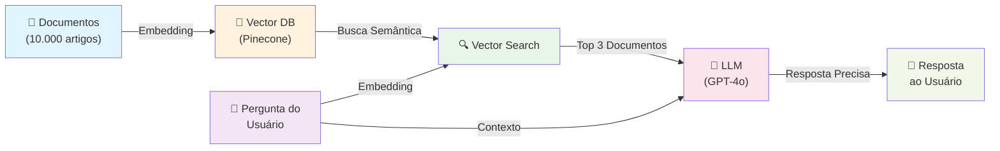
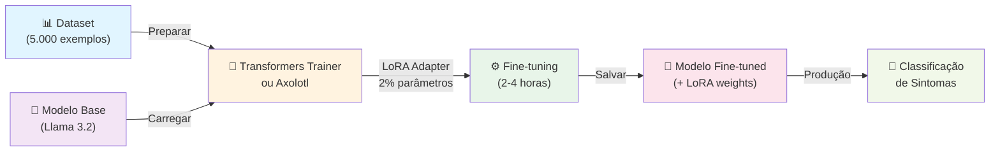
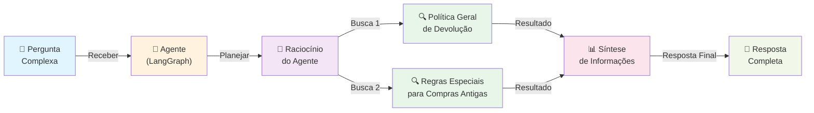
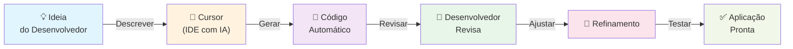
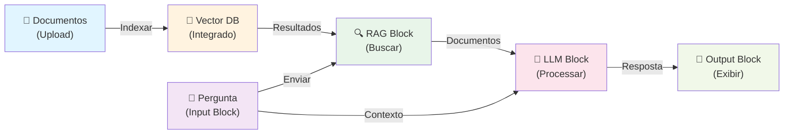
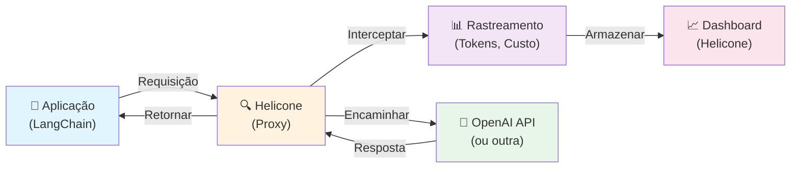

# fudAI-se

# Soluções de IA - Conceitos, Ferramentas e Recursos

<div align="center">

<!-- Modelos de IA -->
[](https://openai.com)
[](https://anthropic.com)
[](https://deepmind.google/technologies/gemini/)
[](https://ai.meta.com/llama/)
[](https://mistral.ai)
[](https://huggingface.co)
[](https://www.deepseek.com/)
[](https://www.alibabacloud.com/)

<!-- Geração de Imagem, Áudio e Vídeo -->
[](https://stability.ai/)
[](https://www.midjourney.com/)
[](https://elevenlabs.io/)
[](https://suno.ai/)

<!-- Frameworks & Orquestração -->
[](https://langchain.com)
[](https://www.llamaindex.ai/)
[](https://github.com/microsoft/semantic-kernel)
[](https://microsoft.github.io/autogen/)
[](https://github.com/stanfordnlp/dspy)
[](https://langchain.com/langgraph)

<!-- Frontend & Backend -->
[](https://streamlit.io)
[](https://fastapi.tiangolo.com)
[](https://gradio.app/)
[](https://chainlit.io/)

<!-- Deep Learning & Dados -->
[](https://pytorch.org)
[](https://www.tensorflow.org)
[](https://scikit-learn.org/)
[](https://pandas.pydata.org/)
[](https://numpy.org/)
[](https://opencv.org/)
[](https://spacy.io/)
[](https://jax.readthedocs.io/)

<!-- Bancos de Dados -->
[](https://www.pinecone.io)
[](https://weaviate.io)
[](https://qdrant.tech)
[](https://milvus.io)
[](https://neo4j.com)
[](https://www.postgresql.org/)

<!-- Infraestrutura & Cloud -->
[](https://www.docker.com/)
[](https://kubernetes.io/)
[](https://www.ray.io/)
[](https://cloud.google.com/vertex-ai)
[](https://aws.amazon.com/sagemaker/)
[](https://azure.microsoft.com/en-us/products/machine-learning/)
[](https://groq.com/)
[](https://runpod.io/)
[](https://modal.com/)
[](https://vercel.com/)

<!-- Observabilidade & Monitoramento -->
[](https://www.datadoghq.com/)
[](https://www.helicone.ai/)
[](https://smith.langchain.com/)
[](https://langfuse.com/)
[](https://wandb.ai/)
[](https://mlflow.org/)

<!-- Ferramentas, Busca & Automação -->
[](https://www.python.org/)
[](https://mermaid.js.org)
[](https://github.com/unslothai/unsloth)
[](https://github.com/OpenAccess-AI-Collective/axolotl)
[](https://www.perplexity.ai/)
[](https://modelcontextprotocol.io/)
[](https://tavily.com/)
[](https://dify.ai/)
[](https://ollama.com/)
[](https://cursor.sh/)
[](https://github.com/features/copilot)
[](https://www.make.com/)
[](https://n8n.io/)
[](https://zapier.com/)

</div>

</div>

---

## 1. Conceitos Fundamentais de IA

### 1.1 Arquiteturas e Tipos de Modelos

| Conceito               | Definição                                                   | Características                                                   |
| :--------------------- | :---------------------------------------------------------- | :--------------------------------------------------------------- |
| **LLM**                | Modelo neural treinado em bilhões de tokens de texto        | Parâmetros: 7B-405B; Entende contexto; Suporta múltiplos idiomas  |
| **SLM**                | Versão compacta de LLM (1B-8B parâmetros)                   | Tamanho: 1GB-8GB; Latência <100ms; Roda offline                  |
| **VLM**                | Modelo que processa texto, imagens e vídeos                 | Processa múltiplas modalidades; Descreve cenas complexas         |
| **MoE**                | Arquitetura com diferentes "especialistas"                  | Escalabilidade; Eficiência; Mixtral 8x7B                         |
| **Text-to-Image**      | Modelo que cria imagens a partir de texto                   | Geração em tempo real; Múltiplos estilos; Alta resolução         |
| **Image-to-Text**      | Modelo que descreve imagens em linguagem natural            | Descrição detalhada; Extração de texto em imagens                |
| **Multimodal Learning** | Modelos que processam múltiplas modalidades simultaneamente | Integração de modalidades; Contexto rico                         |

### 1.2 Técnicas e Métodos (RAG & Training)

| Conceito | Definição | Características |
|----------|-----------|----------------|
| **RAG** | Conecta LLM a base de conhecimento externa | Busca documentos; Aumenta precisão; Reduz alucinações |
| **Agentic RAG** | Agente decide autonomamente quando buscar | Planejamento inteligente; Múltiplas buscas coordenadas |
| **GraphRAG** | Combina knowledge graphs com busca vetorial | Mapeia relacionamentos; Análise de redes |
| **Fine-tuning** | Treinar modelo com dados específicos do domínio | Adapta modelo genérico; Melhora precisão |
| **LoRA** | Fine-tuning eficiente com matrizes de baixa dimensionalidade | Reduz parâmetros em 99%; Treinamento 10x mais rápido |
| **Quantization** | Reduz precisão numérica do modelo | Reduz tamanho em 75%; Aumenta velocidade em 4x |
| **RLHF** | Alinha modelo com preferências humanas | Melhora qualidade; Reduz respostas indesejadas |
| **Transfer Learning** | Usa conhecimento de um modelo treinado | Reutilização de conhecimento; Reduz tempo de treinamento |
| **Tool Use / Function Calling** | Modelo chama funções externas | Integração com sistemas; Acesso a dados em tempo real |

### 1.3 Engenharia de Prompts e Inferência

| Conceito | Definição | Características |
|----------|-----------|----------------|
| **Prompt Engineering** | Formular prompts eficazes | Estrutura clara; Few-shot; Instruções explícitas |
| **Chain-of-Thought (CoT)** | Modelo mostra raciocínio passo a passo | Melhora acurácia; Raciocínio transparente |
| **Few-Shot Learning** | Fornecer poucos exemplos no prompt | 2-5 exemplos; Sem treinamento adicional |
| **Zero-Shot Learning** | Executar tarefa sem exemplos | Generalização; Flexibilidade |
| **Temperature** | Controla criatividade vs. determinismo | 0 = determinístico; 1 = criativo |
| **Top-K e Top-P Sampling** | Controle de diversidade nas respostas | Top-K: K tokens mais prováveis; Top-P: até probabilidade P |
| **Speculative Decoding** | Modelo pequeno "rascunha" tokens verificados por maior | Aumenta velocidade 2-3x; Mantém qualidade |

### 1.4 Infraestrutura e Métricas

| Conceito | Definição | Características |
|----------|-----------|----------------|
| **Token** | Unidade básica de processamento em LLMs | ~4 caracteres = 1 token; Contagem determina custo |
| **Context Window** | Quantidade máxima de tokens que modelo processa | Varia de 4K a 200K tokens |
| **TTFT** | Tempo entre envio do prompt e primeiro token | Crítico para UX; Menor é melhor |
| **TPS** | Tokens gerados por segundo | >50 TPS ideal para leitura humana |
| **KV Cache** | Armazena cálculos de atenção passados | Reduz computação repetitiva; Aumenta velocidade |
| **Batch Processing** | Processar grandes volumes com preço reduzido | Economia de 50-80%; Ideal para volumes altos |
| **Streaming** | Processamento em tempo real | Latência <1s; Ideal para chatbots |
| **Hallucination** | Modelo gera informações incorretas | Reduzido com RAG; Mitigado com fact-checking |

### 1.5 Domínios e Busca

| Conceito | Definição | Características |
|----------|-----------|----------------|
| **NLP** | Compreensão e geração de linguagem natural | Análise de sentimento; Extração de entidades; Tradução |
| **Computer Vision** | Análise e compreensão de imagens e vídeos | Detecção de objetos; Segmentação; Reconhecimento facial |
| **OCR** | Extrai texto de imagens ou documentos | Reconhecimento de caracteres; Preservação de layout |
| **ASR** | Converte áudio falado em texto | Reconhecimento de fala; Suporte multilíngue |
| **TTS** | Converte texto em áudio falado | Síntese de voz natural; Múltiplas vozes |
| **Embeddings** | Representação numérica que captura significado | Dimensionalidade: 384-1536; Busca semântica |
| **Vector Search** | Busca por similaridade em espaço vetorial | Busca por significado; Rápida em grandes volumes |
| **Semantic Search** | Busca que entende significado | Busca por conceito; Resultados mais relevantes |
| **Knowledge Graph** | Representação estruturada de conhecimento | Mapeia relacionamentos; Raciocínio lógico |
| **Retrieval Ranking** | Reordena resultados de busca | Melhora precisão em 20-40%; Usa cross-encoders |
| **Query Rewriting** | Reformula queries do usuário | Expande queries; Melhora relevância |

---

## 2. Ferramentas e Frameworks

### 2.1 Frameworks

| Framework | O que faz | Quando usar |
|-----------|-----------|-------------|
| **LangChain** | Simplifica construção de aplicações com LLMs | Qualquer aplicação com LLM; RAG; Chains; Agents |
| **LangGraph** | Construir agentes com controle via state machines | Agentes complexos; Workflows múltiplas etapas |
| **DSPy** | Otimizar prompts programaticamente | Pipelines complexos; Otimização automática |
| **AutoGen** | Multi-agent systems onde agentes conversam | Sistemas multi-agente; Colaboração entre agentes |
| **LlamaIndex** | Construir aplicações RAG com indexação inteligente | RAG; Indexação de documentos; Busca semântica |
| **Streamlit** | Criar aplicações web interativas com Python | Prototipagem rápida; Dashboards; Demos |
| **Gradio** | Criar interfaces web para modelos de ML | Demos de modelos; Interfaces simples |
| **FastAPI** | Construir APIs rápidas e eficientes | APIs de produção; Microserviços |
| **TensorFlow** | Framework de deep learning do Google | Deep learning; Pesquisa; Produção |
| **PyTorch** | Framework de deep learning do Meta | Pesquisa; Prototipagem; Flexibilidade |
| **JAX** | Computação numérica com diferenciação automática | Pesquisa avançada; Computação de alto desempenho |

---

### 2.2 Bibliotecas

| Biblioteca | O que faz | Quando usar |
|------------|-----------|-------------|
| **Hugging Face Transformers** | Acesso a milhares de modelos pré-treinados | Fine-tuning; Uso de modelos open-source |
| **spaCy** | NLP otimizada para produção | Processamento de texto; Extração de entidades |
| **OpenCV** | Visão computacional | Processamento de imagem; Manipulação de vídeo |
| **Scikit-learn** | ML clássico com algoritmos tradicionais | Classificação; Regressão; Clustering |
| **Pandas** | Manipulação e análise de dados estruturados | Processamento de dados; Análise |
| **NumPy** | Computação numérica e operações em arrays | Cálculos numéricos; Operações matriciais |
| **Matplotlib / Seaborn** | Visualização de dados e gráficos | Visualização; Análise exploratória |
| **Plotly** | Visualizações interativas e dashboards | Dashboards interativos; Visualizações web |

---

### 2.3 Engines

| Engine | O que faz | Quando usar |
|--------|-----------|-------------|
| **YOLO** | Detecção de objetos em tempo real | Detecção de objetos; Vigilância; Análise de vídeo |
| **Detectron2** | Detecção e segmentação de objetos avançada | Segmentação de instâncias; Detecção complexa |
| **Tesseract** | OCR open-source com 100+ idiomas | Extração de texto de imagens; Documentos escaneados |
| **vLLM** | Serving de LLMs com alta throughput | Serving de modelos; Alta performance |
| **TGI** | Serving de LLMs em produção | Serving de modelos; Otimizado para produção |

---

### 2.4 Plataformas

| Plataforma | O que faz | Quando usar |
|-----------|-----------|-------------|
| **Dify** | Construir aplicações de IA sem código | Não-técnicos; Prototipagem rápida; Chatbots |
| **Ollama** | Rodar modelos LLM localmente | Modelos offline; Privacidade; Desenvolvimento local |
| **LangSmith** | Rastrear, debugar e monitorar aplicações LLM | Debugging; Observabilidade; Otimização de prompts |
| **Langfuse** | Observabilidade open-source para LLMs | Rastreamento; Analytics; Debugging |
| **Weights & Biases** | Rastreamento de experimentos de ML | Treinamento de modelos; Experimentos |
| **MLflow** | Gerenciar ciclo de vida de ML | Versionamento de modelos; Rastreamento; Deployment |
| **Prompt Flow** | Construir e testar workflows com LLMs | Desenvolvimento de prompts; Workflows; Testes |
| **Semantic Kernel** | Integrar LLMs em aplicações .NET | Integração com C#/.NET; Plugins; Orquestração |

---

### 2.5 Frameworks de Fine-tuning

| Framework | Tipo | O que faz | Quando usar |
|-----------|------|-----------|-------------|
| **Transformers Trainer** | Open-source | Fine-tuning de modelos Hugging Face | Fine-tuning de LLMs; Mais utilizado |
| **Axolotl** | Open-source | Fine-tuning com configuração YAML | Fine-tuning rápido; Configuração simples |
| **TRL** | Open-source | RLHF e fine-tuning com reforço | Fine-tuning com feedback humano |
| **Unsloth** | Open-source | Fine-tuning rápido e eficiente | Fine-tuning 2-5x mais rápido; Economia de memória |
| **Torchtune** | Open-source | Fine-tuning de modelos Llama | Fine-tuning de Llama; Otimizado |

---

### 2.6 Orquestradores

| Orquestrador | O que faz | Quando usar |
|--------------|-----------|-------------|
| **Kubernetes** | Orquestração de containers em escala | Deployment em escala; Alta disponibilidade |
| **Airflow** | Orquestração de workflows de dados complexos | Pipelines de dados; Agendamento |
| **Prefect** | Orquestração de workflows moderna | Pipelines de dados; Workflows complexos |

---

### 2.7 Plataformas No-Code / Low-Code

| Plataforma | O que faz | Quando usar |
|------------|-----------|-------------|
| **Dify** | Construir aplicações de IA sem código | Não-técnicos; Prototipagem rápida |
| **Make** | Automação de workflows sem código | Integração de sistemas; Automação de processos |
| **Zapier** | Automação e integração de aplicações | Conectar apps; Automação de tarefas |
| **n8n** | Automação open-source de workflows | Open-source; Automação complexa; Self-hosted |
| **Bubble** | Construir aplicações web sem código | Aplicações web completas; Prototipagem rápida |
| **FlutterFlow** | Construir apps mobile sem código | Apps mobile; UI/UX visual |

---

### 2.8 Plataformas Vibecoding

| Plataforma | O que faz | Quando usar |
|------------|-----------|-------------|
| **Cursor** | IDE com IA integrada | Desenvolvimento rápido; Pair programming com IA |
| **GitHub Copilot** | Autocompletar de código com IA | Desenvolvimento; Sugestões de código |
| **Windsurf** | IDE com IA para desenvolvimento assistido | Desenvolvimento rápido; Alternativa a Cursor |
| **Cline** | Agente de IA para desenvolvimento | Desenvolvimento autônomo; Criação de projetos |
| **Claude for VSCode** | Extensão Claude no VSCode | Desenvolvimento com Claude; Integração VSCode |
| **Aider** | CLI para desenvolvimento assistido por IA | Desenvolvimento via terminal; Pair programming |

---

### 2.9 Plataformas de Deployment

| Plataforma | O que faz | Quando usar |
|------------|-----------|-------------|
| **Docker** | Containerização de aplicações | Deployment; Escalabilidade; Reprodutibilidade |
| **Ray** | Processamento paralelo e ML em escala | Processamento paralelo; Treinamento distribuído |
| **Vertex AI** | Plataforma Google para ML | ML end-to-end; AutoML; Modelos Google |
| **SageMaker** | Plataforma AWS para ML | ML end-to-end; Treinamento; Deployment |
| **Azure ML** | Plataforma Microsoft para ML | ML end-to-end; Integração Azure |
| **Modal** | Platform serverless para rodar código Python em GPU | Deployment rápido; Escalável |
| **RunPod** | Plataforma para rodar workloads em GPU | GPU acessível; Treinamento; Inference |

---

### 2.10 Ferramentas de Avaliação e Testing

| Ferramenta | O que faz | Quando usar |
|------------|-----------|-------------|
| **RAGAS** | Avaliar qualidade de sistemas RAG | Avaliar RAG; Métricas de relevância |
| **DeepEval** | Avaliar qualidade de LLMs | Testes de LLM; Métricas customizadas |
| **Braintrust** | Avaliar e comparar LLMs | Comparação de modelos; A/B testing |

---

### 2.11 Ferramentas de Processamento de Dados

| Ferramenta | O que faz | Quando usar |
|------------|-----------|-------------|
| **Airbyte** | ETL/ELT open-source | Integração de dados; Pipelines de dados |
| **dbt** | Transformação de dados em data warehouses | Transformação de dados; Data modeling |
| **Label Studio** | Data labeling open-source | Criar datasets; Anotação de dados; Fine-tuning |

---

### 2.12 Ferramentas de Monitoramento de Custos

| Ferramenta | O que faz | Quando usar |
|------------|-----------|-------------|
| **Helicone** | Rastrear gastos com APIs de LLM | Monitoramento de custos; Analytics |
| **Lithic** | Monitoramento de uso de APIs | Rastreamento de uso; Alertas; Análise de custos |

---

## 3. Recursos, Serviços e APIs

### 3.1 Modelos LLM (Open-source)

| Modelo | Provedor | Características |
|--------|----------|----------------|
| **Llama 3.2, 3.1, 2** | Meta | Open-source; 1B-405B parâmetros; Roda localmente |
| **Mistral 7B, Mixtral 8x7B** | Mistral AI | Open-source; Eficiente; Excelente custo-benefício |
| **Qwen 2.5** | Alibaba | Open-source; Múltiplos tamanhos; Muito utilizado na Ásia |
| **DeepSeek-V3** | DeepSeek | Open-source; Excelente raciocínio; Custo-benefício superior |

---

### 3.2 Modelos LLM (Proprietários)

| Modelo | Provedor | Características |
|--------|----------|----------------|
| **GPT-4o, GPT-4 Turbo, GPT-3.5 Turbo** | OpenAI | Mais utilizado; 128K tokens; Visão |
| **Claude 3.5 Sonnet, Claude 3 Opus** | Anthropic | Excelente raciocínio; 200K tokens |
| **Gemini 2.0 Flash, Gemini 1.5 Pro** | Google | Multimodal; 1M tokens; Análise de vídeos |

---

### 3.3 Modelos de Embedding

| Modelo | Provedor | Características |
|--------|----------|----------------|
| **text-embedding-3-large** | OpenAI | Mais utilizado; 3072 dimensões; Qualidade superior |
| **text-embedding-3-small** | OpenAI | Versão rápida; 1536 dimensões; Bom custo-benefício |
| **nomic-embed-text** | Nomic AI | Open-source; 768 dimensões; Alternativa gratuita |
| **bge-large-en-v1.5** | BAAI | Open-source; 1024 dimensões; Excelente performance |

---

### 3.4 Modelos de Reranking

| Modelo | Provedor | Características |
|--------|----------|----------------|
| **bge-reranker-large** | BAAI | Open-source; Melhora precisão em 20-40%; Roda localmente |
| **cross-encoder/ms-marco-MiniLM-L-12-v2** | Sentence Transformers | Open-source; Rápido; Bom custo-benefício |

---

### 3.5 Modelos de Código

| Modelo | Provedor | Características |
|--------|----------|----------------|
| **CodeLlama** | Meta | Open-source; Especializado em código; Roda localmente |
| **Deepseek-Coder** | DeepSeek | Open-source; Excelente em código; Muito preciso |

---

### 3.6 Modelos Vision (VLM)

| Modelo | Provedor | Características |
|--------|----------|----------------|
| **GPT-4o Vision** | OpenAI | Mais utilizado; Análise de imagens; Extração de texto |
| **Claude Vision** | Anthropic | Análise detalhada; Extração de informações |
| **Gemini Vision** | Google | Análise de imagens; Análise de vídeos |
| **LLaVA** | Open-source | Open-source; Roda localmente; Alternativa gratuita |

---

### 3.7 Modelos Text-to-Image

| Modelo | Provedor | Características |
|--------|----------|----------------|
| **DALL-E 3** | OpenAI | Mais utilizado em produção; Qualidade alta |
| **Stable Diffusion 3** | Stability AI | Open-source; Roda localmente; Comunidade grande |
| **Midjourney** | Midjourney | Qualidade artística; Interface Discord |

---

### 3.8 Modelos ASR (Speech-to-Text)

| Modelo | Provedor | Características |
|--------|----------|----------------|
| **Whisper** | OpenAI | Open-source; Mais utilizado; Múltiplos idiomas; Roda localmente |
| **Google Speech-to-Text** | Google | Muito utilizado em produção; Múltiplos idiomas |

---

### 3.9 Modelos TTS (Text-to-Speech)

| Modelo | Provedor | Características |
|--------|----------|----------------|
| **OpenAI TTS** | OpenAI | Muito utilizado; Múltiplas vozes; Latência baixa |
| **ElevenLabs** | ElevenLabs | Vozes mais realistas; Muito usado em produção |
| **Bark** | Suno AI | Open-source; Roda localmente; Alternativa gratuita |

---

### 3.10 Vector Databases

| Banco | Tipo | Características |
|-------|------|----------------|
| **Pinecone** | SaaS | Mais utilizado em produção; Gerenciado; Escalável |
| **Weaviate** | Open/SaaS | Open-source; Customizável; Suporte a múltiplos modelos |
| **Milvus** | Open-source | Open-source; Escalável; Muito usado na Ásia |
| **Qdrant** | Open/SaaS | Open-source; Rápido; Filtros avançados |
| **PostgreSQL + pgvector** | Open-source | Open-source; Integração com banco relacional; Custo baixo |

---

### 3.11 Bancos de Dados de Grafos

| Banco | Tipo | Características |
|-------|------|----------------|
| **Neo4j** | SaaS / Open | Mais utilizado para GraphRAG; Consultas poderosas |

---

### 3.12 Serviços de Busca

| Serviço | O que faz | Características |
|---------|-----------|----------------|
| **Perplexity API** | Busca com IA em tempo real | Busca em tempo real; Citações; Respostas estruturadas |
| **Tavily Search API** | Busca otimizada para agentes | Busca relevante; Integrada com LangChain |
| **Serper API** | Busca do Google para agentes | Busca Google; Rápida; Confiável |

---

### 3.13 Serviços de Fine-tuning

| Serviço | Provedor | Características |
|---------|----------|----------------|
| **OpenAI Fine-tuning API** | OpenAI | Mais utilizado; Simples; Rápido |
| **Anthropic Fine-tuning** | Anthropic | Qualidade; Suporte; Customização |

---

### 3.14 Plataformas de Observability

| Plataforma | O que faz | Características |
|------------|-----------|----------------|
| **LangSmith** | Rastreamento e debugging de LLMs | Rastreamento completo; Debugging; Otimização |
| **Langfuse** | Observabilidade open-source para LLMs | Open-source; Rastreamento; Analytics |
| **Datadog** | Monitoramento e observabilidade | Monitoramento completo; Alertas; Integração |

---

### 3.15 Repositórios de Modelos

| Repositório | O que oferece | Características |
|-------------|---------------|----------------|
| **Hugging Face Hub** | Repositório de modelos open-source | 500K+ modelos; Datasets; Spaces; Comunidade |
| **OpenRouter** | Agregador de modelos | Acesso a múltiplos modelos via API unificada |

---

### 3.16 Serviços de Model Serving

| Serviço | O que faz | Características |
|---------|-----------|----------------|
| **Replicate** | Rodar modelos open-source via API | Sem gerenciar infraestrutura; Preço por uso |
| **Together AI** | Rodar modelos open-source | Modelos open-source; Preço competitivo |
| **Groq** | Hardware especializado para LLMs | Muito rápido; Latência baixa |
| **Hugging Face Spaces** | Hospedar e compartilhar modelos | Hosting de modelos; Demos; Colaboração; Gratuito |

---

## 4. Exemplos Práticos com Arquitetura

### Exemplo 1: RAG - Retrieval-Augmented Generation

**Caso de Uso:** Empresa tem 10.000 artigos de suporte e quer chatbot que responda com precisão.

**Problema:**
- LLM genérico não conhece produtos específicos
- Respostas genéricas e imprecisas
- Clientes ficam insatisfeitos

**Solução com RAG:**
```
1. Cliente pergunta: "Como resetar minha senha?"
2. Sistema busca na base de conhecimento
3. Encontra: "Artigo #234: Resetar senha em 3 passos"
4. LLM lê artigo + pergunta
5. Responde com instruções precisas do seu produto
```

**Snippet de Código (Python + LangChain):**
```python
from langchain_openai import ChatOpenAI, OpenAIEmbeddings
from langchain_community.vectorstores import FAISS
from langchain_core.prompts import ChatPromptTemplate
from langchain_core.runnables import RunnablePassthrough

model = ChatOpenAI(model="gpt-4o")
vectorstore = FAISS.from_texts(
    ["Artigo #234: Para resetar a senha, acesse configurações > segurança."], 
    embedding=OpenAIEmbeddings()
)
retriever = vectorstore.as_retriever()

template = "Responda com base no contexto: {context}\nPergunta: {question}"
prompt = ChatPromptTemplate.from_template(template)
chain = (
    {"context": retriever, "question": RunnablePassthrough()}
    | prompt
    | model
)

print(chain.invoke("Como reseto a senha?").content)
```

**Arquitetura RAG:**


**Como usar:**
1. **Preparar documentos:** Coletar artigos, dividir em chunks de 500 tokens, gerar embeddings
2. **Indexar:** Usar Pinecone ou Weaviate, armazenar embeddings + metadados
3. **Buscar:** Converter pergunta em embedding, buscar top 3 documentos similares
4. **Melhorias:** Usar reranking (bge-reranker-large) e query rewriting

**Ferramentas:** LangChain/LlamaIndex, Pinecone/Weaviate, OpenAI API, LangSmith

**Benefício:** Respostas precisas, reduz alucinações, conhecimento atualizado.

---

### Exemplo 2: Fine-tuning com LoRA

**Caso de Uso:** Clínica médica quer modelo que classifique sintomas com precisão médica.

**Problema:**
- GPT genérico confunde sintomas
- Resposta: "Pode ser gripe ou COVID"
- Não é confiável para diagnóstico

**Solução com Fine-tuning:**
```
1. Coletar 5.000 exemplos de sintomas + diagnósticos corretos
2. Treinar modelo com LoRA (eficiente)
3. Modelo aprende padrões específicos
4. Resposta: "Baseado em seus sintomas, probabilidade 85% de bronquite viral"
```

**Snippet de Código (Python + Unsloth):**
```python
from unsloth import FastLanguageModel
from trl import SFTTrainer
from transformers import TrainingArguments

model, tokenizer = FastLanguageModel.from_pretrained(
    model_name = "unsloth/llama-3-8b-bnb-4bit",
    max_seq_length = 2048,
    load_in_4bit = True,
)

model = FastLanguageModel.get_peft_model(
    model, r = 16, target_modules = ["q_proj", "k_proj", "v_proj", "o_proj"],
    lora_alpha = 16, lora_dropout = 0,
    use_gradient_checkpointing = True,
)

trainer = SFTTrainer(
    model = model, tokenizer = tokenizer, train_dataset = dataset,
    dataset_text_field = "text", max_seq_length = 2048,
    args = TrainingArguments(
        per_device_train_batch_size = 2, gradient_accumulation_steps = 4,
        max_steps = 60, learning_rate = 2e-4,
        fp16 = not torch.cuda.is_bf16_supported(),
        bf16 = torch.cuda.is_bf16_supported(), output_dir = "outputs",
    ),
)

trainer.train()
```

**Arquitetura:**


**Como usar:**
1. **Preparar Dataset:** 5.000 exemplos (sintomas → diagnóstico), formato JSONL
2. **Escolher Framework:** Transformers Trainer, Axolotl ou Unsloth
3. **Configurar LoRA:** Rank 8-16, reduzir parâmetros em 99%
4. **Treinar:** 2-4 horas em GPU
5. **Deployar:** Usar vLLM ou TGI, latência <100ms

**Ferramentas:** Transformers Trainer/Axolotl, Unsloth, TRL, RAGAS, vLLM

**Benefício:** Precisão especializada, confiável para domínio específico.

---

### Exemplo 3: Agentic RAG com LangGraph

**Caso de Uso:** Responder: *"Qual é a política de devolução para clientes que compraram há mais de 30 dias?"*

**Problema:**
- RAG simples busca por "devolução"
- Retorna artigo genérico
- Não responde a pergunta específica

**Solução com Agentic RAG:**
```
1. Agente recebe pergunta
2. Pensa: "Preciso de 2 informações: política geral + regras especiais"
3. Executa 2 buscas diferentes
4. Sintetiza: "Política geral é 30 dias, mas há exceção se produto tiver defeito"
```

**Snippet de Código (Python + LangGraph):**
```python
from langgraph.graph import StateGraph, END
from typing import TypedDict, Annotated

class AgentState(TypedDict):
    question: str
    context: str
    answer: str

def retrieve(state):
    return {"context": "Contexto recuperado"}

def generate(state):
    return {"answer": "Resposta gerada"}

workflow = StateGraph(AgentState)
workflow.add_node("retrieve", retrieve)
workflow.add_node("generate", generate)
workflow.set_entry_point("retrieve")
workflow.add_edge("retrieve", "generate")
workflow.add_edge("generate", END)

app = workflow.compile()
result = app.invoke({"question": "Minha pergunta"})
```

**Arquitetura:**


**Ferramentas:** LangGraph, LangChain, Pinecone/Weaviate, LangSmith

**Benefício:** Respostas mais precisas, raciocínio inteligente, menos alucinações.

---

### Exemplo 4: Vibecoding com Cursor

**Caso de Uso:** Desenvolver aplicação RAG em 1 dia (vs 1 semana manualmente).

**Problema:**
- Desenvolvimento manual é lento
- Muitos erros de digitação
- Debugging consome tempo

**Solução com Vibecoding:**
```
1. Abrir Cursor
2. Descrever: "Crie um chatbot RAG com LangChain"
3. Cursor gera código automaticamente
4. Você revisa e ajusta
5. Pronto em horas, não dias
```

**Arquitetura:**


**Ferramentas:** Cursor, GitHub Copilot, Claude API/OpenAI API

**Benefício:** Desenvolvimento 5-10x mais rápido, menos erros.

---

### Exemplo 5: No-Code com Dify

**Caso de Uso:** Não-técnico quer criar chatbot RAG sem escrever código.

**Problema:**
- Não sabe programar
- Precisa de solução rápida
- Orçamento limitado

**Solução com Dify:**
```
1. Abrir Dify
2. Criar novo "Application"
3. Arrastar blocos: Input → RAG → LLM → Output
4. Conectar blocos
5. Publicar como API ou chatbot
6. Pronto! Sem uma linha de código
```

**Arquitetura:**


**Ferramentas:** Dify, OpenAI API/Claude API

**Benefício:** Não-técnicos constroem aplicações complexas, desenvolvimento rápido.

---

### Exemplo 6: Monitoramento de Custos com Helicone

**Caso de Uso:** Empresa usa 10 APIs de LLM e quer rastrear gastos.

**Problema:**
- Múltiplas APIs (OpenAI, Anthropic, Google)
- Difícil rastrear gastos
- Sem visibilidade de custos por aplicação

**Solução com Helicone:**
```
1. Integrar Helicone em todas as APIs
2. Helicone intercepta requisições
3. Rastreia: tokens, custo, latência, modelo
4. Dashboard mostra gastos em tempo real
5. Alertas quando gastos excedem limite
```

**Snippet de Código (Python + Helicone):**
```python
from openai import OpenAI

client = OpenAI(
    api_key="sk-...",
    base_url="https://oai.hconeai.com/v1",
    default_headers={"Helicone-Auth": "Bearer sk-helicone-..."}
)

response = client.chat.completions.create(
    model="gpt-4o",
    messages=[{"role": "user", "content": "Olá!"}],
    user="user-123"
)
```

**Arquitetura:**


**Ferramentas:** Helicone, OpenAI API/Anthropic API, LangChain

**Benefício:** Visibilidade de custos, otimização de gastos, alertas automáticos.

---

## 5. Segurança e Governança

### 5.1 Principais Vulnerabilidades (OWASP Top 10 LLM)

| Vulnerabilidade | Descrição | Mitigação |
|----------------|-----------|-----------|
| **Prompt Injection** | Atacante manipula input para ignorar instruções | Delimitadores claros; Validação de input; LLM Guardrails |
| **Insecure Output Handling** | Saída do LLM executada sem validação | Sandboxing; Tratamento de saída como não confiável |
| **Sensitive Data Exposure** | Modelo revela PII ou segredos | PII Redaction; Filtragem de saída |
| **Model Denial of Service** | Atacante sobrecarrega modelo | Rate limiting; Limites de tokens; Timeouts |

### 5.2 Ferramentas de Segurança

| Ferramenta | O que faz | Quando usar |
|------------|-----------|-------------|
| **NeMo Guardrails** | Adicionar regras de segurança em diálogos | Bloquear tópicos sensíveis; Validação de fatos |
| **Lakera Guard** | Detecção de Prompt Injection e Jailbreaks | Proteção de endpoints públicos |
| **Microsoft Presidio** | Detecção e anonimização de PII | Mascarar dados sensíveis; Compliance (LGPD/GDPR) |
| **Garak** | Red teaming automatizado para LLMs | Testar vulnerabilidades; Scan de segurança |

---

## Estrutura

- 35+ Conceitos fundamentais
- Ferramentas por tipo (Frameworks, Bibliotecas, Engines, Plataformas, Fine-tuning)
- Recursos (Modelos, Vector Databases, Embeddings, Reranking)
- 6 Exemplos práticos com diagramas Mermaid
- Arquitetura visual para cada solução

**Exercícios:**
1. Identifique seu caso de uso principal
2. Escolha as ferramentas certas da tabela
3. Comece com prototipagem rápida (Dify, LangChain)
4. Escale com observabilidade (LangSmith, Langfuse)
5. Monitore custos (Helicone)

---

Otavio Lemos | otavieraspfc@gmail.com
