# fudAI-se

## canivete suiço de ia - conceitos, ferramentas e recursos
## espero que esse canivete suiço de ia salve naqueles momentos imediatos igual o canivete do shell me salvou inumeras vezes...
### grande aurelio, copiada sua ideia https://aurelio.net/shell/canivete/ e espero que salve muitas pessoas assim como fui salvo...

---

**llms:** [](https://ai.meta.com) [](https://deepseek.com) [](https://mistral.ai) [](https://qwenlm.github.io) [](https://azure.microsoft.com) [](https://cohere.com) [](https://www.nvidia.com) [](https://www.ibm.com/granite) [](https://01.ai) [](https://ai.google.dev/gemma) [](https://openai.com) [](https://anthropic.com) [](https://deepmind.google) [](https://x.ai)

**frameworks:** [](https://langchain.com) [](https://llamaindex.ai) [](https://crewai.com) [](https://langchain.com/langgraph) [](https://microsoft.github.io/autogen) [](https://github.com/microsoft/semantic-kernel) [](https://github.com/stanfordnlp/dspy) [](https://haystack.deepset.ai)

**rag & training:** [](https://langchain.com) [](https://langchain.com) [](https://microsoft.github.io/graphrag) [](https://langchain.com) [](https://www.pinecone.io/learn/hybrid-search) [](https://huggingface.co/docs/peft) [](https://huggingface.co/docs/trl/dpo)

**bancos de dados:** [](https://pinecone.io) [](https://weaviate.io) [](https://qdrant.tech) [](https://milvus.io) [](https://neo4j.com) [](https://postgresql.org)

**infra:** [](https://docker.com) [](https://kubernetes.io) [](https://ray.io) [](https://cloud.google.com/vertex-ai) [](https://aws.amazon.com/sagemaker) [](https://azure.microsoft.com) [](https://modal.com) [](https://runpod.io)

**vibecoding:** [](https://cursor.sh) [](https://github.com/features/copilot) [](https://codeium.com/windsurf) [](https://bolt.new) [](https://v0.dev)

**observabilidade:** [](https://datadoghq.com) [](https://helicone.ai) [](https://smith.langchain.com) [](https://langfuse.com) [](https://wandb.ai) [](https://mlflow.org)

---

## 1. conceitos fundamentais de ia

### 1.1 arquiteturas e tipos de modelos

| conceito                | definição                                                   | características                                                             |
| ----------------------- | ----------------------------------------------------------- | --------------------------------------------------------------------------- |
| llm                     | modelo neural treinado em bilhões de tokens de texto        | parâmetros: 7b-405b; entende contexto; suporta múltiplos idiomas            |
| vlm                     | modelo que processa texto, imagens e vídeos                 | processa múltiplas modalidades; descreve cenas complexas                    |
| slm                     | versão compacta de llm (1b-8b parâmetros)                   | tamanho: 1gb-8gb; latência <100ms; roda offline                             |
| moe                     | arquitetura com diferentes "especialistas"                  | escalabilidade; eficiência; mixtral 8x7b                                    |
| text-to-image           | modelo que cria imagens a partir de texto                   | geração em tempo real; múltiplos estilos; alta resolução                    |
| image-to-text           | modelo que descreve imagens em linguagem natural            | descrição detalhada; extração de texto em imagens                           |
| multimodal learning     | modelos que processam múltiplas modalidades simultaneamente | integração de modalidades; contexto rico                                    |
| arquiteturas emergentes | novas arquiteturas como mamba, rwkv, retnet                 | eficiência computacional; state space models; alternativas aos transformers |

### 1.2 técnicas e métodos (rag & training)

| conceito          | definição                                                    | características                                          |
| ----------------- | ------------------------------------------------------------ | -------------------------------------------------------- |
| rag               | conecta llm a base de conhecimento externa                   | busca documentos; aumenta precisão; reduz alucinações    |
| agentic rag       | agente decide autonomamente quando buscar                    | planejamento inteligente; múltiplas buscas coordenadas   |
| self-rag          | rag com auto-verificação de recuperação                      | decide quando recuperar; avalia qualidade da busca       |
| corrective rag    | rag com correção automática de erros                         | detecta incorreções; re-busca quando necessário          |
| hybrid search     | combina busca vetorial + semântica + por palavras-chave      | maior cobertura; melhor recall                           |
| graphrag          | combina knowledge graphs com busca vetorial                  | mapeia relacionamentos; análise de redes                 |
| fine-tuning       | treinar modelo com dados específicos do domínio              | adapta modelo genérico; melhora precisão                 |
| lora              | fine-tuning eficiente com matrizes de baixa dimensionalidade | reduz parâmetros em 99%; treinamento 10x mais rápido     |
| dpo               | direct preference optimization para alinhamento              | alternativa mais eficiente ao rlhf                       |
| quantization      | reduz precisão numérica do modelo                            | reduz tamanho em 75%; aumenta velocidade em 4x           |
| rlhf              | alinha modelo com preferências humanas                       | melhora qualidade; reduz respostas indesejadas           |
| transfer learning | usa conhecimento de um modelo treinado                       | reutilização de conhecimento; reduz tempo de treinamento |

### 1.3 engenharia de prompts e inferência

| conceito               | definição                                              | características                                            |
| ---------------------- | ------------------------------------------------------ | ---------------------------------------------------------- |
| prompt engineering     | formular prompts eficazes                              | estrutura clara; few-shot; instruções explícitas           |
| chain-of-thought (cot) | modelo mostra raciocínio passo a passo                 | melhora acurácia; raciocínio transparente                  |
| few-shot learning      | fornecer poucos exemplos no prompt                     | 2-5 exemplos; sem treinamento adicional                    |
| temperature            | controla criatividade vs. determinismo                 | 0 = determinístico; 1 = criativo                           |
| zero-shot learning     | executar tarefa sem exemplos                           | generalização; flexibilidade                               |
| top-k e top-p sampling | controle de diversidade nas respostas                  | top-k: k tokens mais prováveis; top-p: até probabilidade p |
| speculative decoding   | modelo pequeno "rascunha" tokens verificados por maior | aumenta velocidade 2-3x; mantém qualidade                  |

### 1.4 infraestrutura e métricas

| conceito            | definição                                            | características                                   |
| ------------------- | ---------------------------------------------------- | ------------------------------------------------- |
| token               | unidade básica de processamento em llms              | ~4 caracteres = 1 token; contagem determina custo |
| context window      | quantidade máxima de tokens que modelo processa      | varia de 4k a 2m tokens (gemini 1.5 pro)          |
| ttft                | tempo entre envio do prompt e primeiro token         | crítico para ux; menor é melhor                   |
| tps                 | tokens gerados por segundo                           | >50 tps ideal para leitura humana                 |
| kv cache            | armazena cálculos de atenção passados                | reduz computação repetitiva; aumenta velocidade   |
| continuous batching | processamento em lotes dinâmicos                     | maior throughput; eficiência em produção          |
| flash attention v3  | otimização de atenção com acesso eficiente à memória | reduz uso de memória; aumenta velocidade          |
| pagedattention v2   | gerenciamento eficiente de memória kv cache          | permite maior batch size; reduz latência          |
| batch processing    | processar grandes volumes com preço reduzido         | economia de 50-80%; ideal para volumes altos      |
| streaming           | processamento em tempo real                          | latência <1s; ideal para chatbots                 |
| hallucination       | modelo gera informações incorretas                   | reduzido com rag; mitigado com fact-checking      |

### 1.5 domínios e busca

| conceito          | definição                                      | características                                         |
| ----------------- | ---------------------------------------------- | ------------------------------------------------------- |
| nlp               | compreensão e geração de linguagem natural     | análise de sentimento; extração de entidades; tradução  |
| embeddings        | representação numérica que captura significado | dimensionalidade: 384-1536; busca semântica             |
| vector search     | busca por similaridade em espaço vetorial      | busca por significado; rápida em grandes volumes        |
| semantic search   | busca que entende significado                  | busca por conceito; resultados mais relevantes          |
| computer vision   | análise e compreensão de imagens e vídeos      | detecção de objetos; segmentação; reconhecimento facial |
| ocr               | extrai texto de imagens ou documentos          | reconhecimento de caracteres; preservação de layout     |
| asr               | converte áudio falado em texto                 | reconhecimento de fala; suporte multilíngue             |
| tts               | converte texto em áudio falado                 | síntese de voz natural; múltiplas vozes                 |
| knowledge graph   | representação estruturada de conhecimento      | mapeia relacionamentos; raciocínio lógico               |
| retrieval ranking | reordena resultados de busca                   | melhora precisão em 20-40%; usa cross-encoders          |
| query rewriting   | reformula queries do usuário                   | expande queries; melhora relevância                     |

---

## 2. ferramentas e frameworks

### 2.1 frameworks (desenvolvimento de ia)

| framework       | o que faz                                           | quando usar                                            |
| --------------- | --------------------------------------------------- | ------------------------------------------------------ |
| langchain       | simplifica construção de aplicações com llms        | aplicações robustas; rag; chains; grande ecossistema   |
| llamaindex      | framework focado em conexão de dados para llms      | rag avançado; indexação inteligente de documentos      |
| crewai          | framework para orquestração de agentes autônomos    | sistemas multi-agente complexos orientados a processos |
| langgraph       | extensão langchain para agentes com estados         | workflows cíclicos e agentes com lógica complexa       |
| pydanticai      | framework para ia estruturada com pydantic          | validação automática; integração com pydantic          |
| outlines        | geração estruturada e controlada                    | garante output em formato específico (json, regex)     |
| instructor      | biblioteca para extração estruturada de dados       | força llm a retornar schemas pydantic válidos          |
| fastapi         | framework web moderno para construção de apis       | backend de produção para serviços de ia                |
| autogen         | framework da microsoft para agentes conversacionais | colaboração entre múltiplos agentes autônomos          |
| semantic kernel | sdk enterprise para integração de llms              | ambientes corporativos (.net, java, python)            |
| dspy            | framework para programação sistemática de prompts   | otimização automática de prompts em pipelines          |
| haystack        | framework de orquestração de nlp end-to-end         | pipelines de busca neural e qa flexíveis               |

> **onde encontrar mais:** [github trending (python)](https://github.com/trending/python) • [awesome langchain](https://github.com/kyrolabs/awesome-langchain) • [thoughtworks radar (platforms)](https://www.thoughtworks.com/radar/platforms)

### 2.2 bibliotecas (dados & ml clássico)

| biblioteca                | o que faz                                           | quando usar                                     |
| ------------------------- | --------------------------------------------------- | ----------------------------------------------- |
| hugging face transformers | acesso a milhares de modelos pré-treinados          | fine-tuning; uso de modelos open-source         |
| spacy                     | nlp otimizada para produção                         | processamento de texto; extração de entidades   |
| opencv                    | visão computacional                                 | processamento de imagem; manipulação de vídeo   |
| scikit-learn              | ml clássico com algoritmos tradicionais             | classificação; regressão; clustering            |
| pandas                    | manipulação e análise de dados estruturados         | processamento de dados; análise                 |
| numpy                     | computação numérica e operações em arrays           | cálculos numéricos; operações matriciais        |
| matplotlib / seaborn      | visualização de dados e gráficos                    | visualização; análise exploratória              |
| plotly                    | visualizações interativas e dashboards              | dashboards interativos; visualizações web       |
| jax                       | framework de computação numérica de alto desempenho | treinamento acelerado; diferenciação automática |

> **onde encontrar mais:** [pypi top packages](https://pypi.org/search/?q=&o=-z&c=topic+%3a%3a+scientific%2fengineering+%3a%3a+artificial+intelligence) • [kaggle kernels](https://www.kaggle.com/code) • [papers with code](https://paperswithcode.com/libraries)

### 2.3 engines (visão & serving)

| engine                   | o que faz                                  | quando usar                                          |
| ------------------------ | ------------------------------------------ | ---------------------------------------------------- |
| yolo (ultralytics)       | detecção de objetos em tempo real          | detecção de objetos; vigilância; análise de vídeo    |
| detectron2               | detecção e segmentação de objetos avançada | segmentação de instâncias; detecção complexa         |
| tesseract                | ocr open-source com 100+ idiomas           | extração de texto de imagens; documentos escaneados  |
| vllm                     | serving de llms com alta throughput        | serving de modelos; alta performance; pagedattention |
| tgi (text gen inference) | serving de llms em produção (hugging face) | serving de modelos; otimizado para produção          |
| ollama                   | runtime local para llms                    | rodar llama/mistral localmente (mac/linux/windows)   |
| localai                  | api local compatível com openai            | drop-in replacement para apis openai rodando local   |

> **onde encontrar mais:** [github topics (computer vision)](https://github.com/topics/computer-vision) • [hugging face spaces](https://huggingface.co/spaces) • [reddit r/localllama](https://www.reddit.com/r/localllama/)

### 2.4 plataformas (desenvolvimento low-code de ia)

| plataforma              | o que faz                             | quando usar                                           |
| ----------------------- | ------------------------------------- | ----------------------------------------------------- |
| dify                    | construir aplicações de ia sem código | não-técnicos; prototipagem rápida; chatbots; rag      |
| langflow                | interface visual para langchain       | criar fluxos de ia arrastando componentes             |
| flowise                 | construtor visual de llm apps         | prototipagem rápida de cadeias de ia (node.js)        |
| prompt flow             | construir e testar workflows com llms | desenvolvimento de prompts; workflows; testes (azure) |
| vertex ai agent builder | plataforma google para agentes        | agentes corporativos; integração com google search    |

> **onde encontrar mais:** [g2 (bot platforms)](https://www.g2.com/categories/bot-platforms) • [product hunt (ai)](https://www.producthunt.com/topics/artificial-intelligence)

### 2.5 frameworks de fine-tuning

| framework            | tipo        | o que faz                                | quando usar                                      |
| -------------------- | ----------- | ---------------------------------------- | ------------------------------------------------ |
| transformers trainer | open-source | fine-tuning de modelos hugging face      | padrão da indústria; integração hf               |
| unsloth              | open-source | fine-tuning 2-5x mais rápido             | otimização extrema de memória (llama/mistral)    |
| axolotl              | open-source | configuração via yaml (no-code friendly) | fine-tuning rápido sem escrever código de treino |
| trl                  | open-source | rlhf e fine-tuning com reforço (ppo/dpo) | alinhamento de modelos com preferências humanas  |
| torchtune            | open-source | biblioteca nativa pytorch para llms      | fine-tuning hackeável e modular                  |
| ludwig               | open-source | framework declarativo para ml            | treinar modelos sem código (uber)                |

> **onde encontrar mais:** [hugging face docs](https://huggingface.co/docs) • [reddit r/localllama](https://www.reddit.com/r/localllama/) • [axolotl examples](https://github.com/openaccess-ai-collective/axolotl/tree/main/examples)

### 2.6 orquestradores (infraestrutura & workflows)

| orquestrador | o que faz                                  | quando usar                                          |
| ------------ | ------------------------------------------ | ---------------------------------------------------- |
| temporal     | motor de execução durável (code-first)     | garantir que agentes/workflows nunca falhem; retries |
| kubernetes   | orquestração de containers em escala       | deployment de produção; escala massiva               |
| keda         | kubernetes event-driven autoscaling        | auto-scaling baseado em eventos; eficiência de custo |
| knative      | plataforma serverless para kubernetes      | deploy serverless; scaling automático                |
| dapr         | distributed application runtime            | microserviços; abstração de infraestrutura           |
| airflow      | orquestração de dados baseada em dags      | pipelines de etl tradicionais e robustos             |
| prefect      | orquestração moderna e observável          | pipelines de dados dinâmicos em python               |
| kestra       | orquestrador universal orientado a eventos | automação de pipelines e infra as code               |

> **onde encontrar mais:** [cncf landscape](https://landscape.cncf.io/) • [data engineering zoomcamp](https://github.com/datatalksclub/data-engineering-zoomcamp) • [temporal use cases](https://temporal.io/use-cases)

### 2.7 automação de workflows & integração

| plataforma | categoria                           | quando usar                                                |
| ---------- | ----------------------------------- | ---------------------------------------------------------- |
| n8n        | orquestração de workflow (low-code) | fluxos complexos com nós lógicos, ia e loops; self-hosted  |
| make       | automação visual                    | integrações rápidas entre saas com lógica condicional      |
| zapier     | automação linear (ipaas)            | conectar apps populares de forma simples (gatilho -> ação) |
| typebot    | chatbot orchestrator                | construtor visual de fluxos de conversação                 |

> **onde encontrar mais:** [automators community](https://community.make.com/) • [n8n templates](https://n8n.io/workflows) • [zapier app directory](https://zapier.com/apps)

### 2.7.1 no-code app builders

| plataforma  | categoria      | quando usar                                       |
| ----------- | -------------- | ------------------------------------------------- |
| bubble      | app builder    | construir aplicações web full-stack complexas     |
| flutterflow | app builder    | criar apps mobile nativos (ios/android)           |
| retool      | internal tools | dashboards administrativos e ferramentas internas |
| webflow     | site builder   | sites de marketing e landing pages profissionais  |
| framer      | site builder   | sites com foco em design e interatividade         |

> **onde encontrar mais:** [nocode list](https://nocodelist.co/) • [makerpad](https://www.makerpad.co/) • [g2 no-code platforms](https://www.g2.com/categories/no-code-development-platforms)

### 2.8 plataformas vibecoding (desenvolvimento assistido por ia)

| plataforma           | diferencial                                      | melhor caso de uso                                                 |
| -------------------- | ------------------------------------------------ | ------------------------------------------------------------------ |
| cursor               | ide nativa com ia (fork do vs code)              | desenvolvimento diário fluido; pair programming; referência atual  |
| github copilot       | padrão da indústria e integração github          | sugestões rápidas e preenchimento de boilerplate                   |
| trae                 | ide adaptativa da bytedance                      | alternativa poderosa com fluxos inteligentes (gratuito atualmente) |
| windsurf             | foco em agentes autônomos dentro da ide          | tarefas complexas assistidas por agentes (cascade flow)            |
| bolt.new             | desenvolvimento full-stack no browser            | prototipagem web ultra-rápida com deploy direto                    |
| v0.dev               | ui generativa da vercel                          | criação de componentes react/tailwind modernos                     |
| lovable              | engenheiro de ia para web apps                   | construir apps funcionais via linguagem natural                    |
| aider                | pair programming via terminal                    | edição de código rápida sem sair do shell; integração git forte    |
| continue             | extensão open-source configurável                | liberdade para escolher modelos (deepseek/claude) no vs code       |
| zed                  | editor de código com ia integrada                | performance nativa; colaboração em tempo real                      |
| cody (sourcegraph)   | assistente de código com contexto do repositório | navegação inteligente; explicação de código                        |
| tabnine              | assistente de código com foco em privacidade     | sugestões locais; proteção de código proprietário                  |
| amazon codewhisperer | assistente de código da aws                      | integração com serviços aws; segurança                             |
| jetbrains ai         | assistente integrado às ides jetbrains           | suporte a múltiplas linguagens; refactoring inteligente            |
| opencode             | agente de ia para desenvolvimento open-source    | automação de tarefas em repositórios e fluxos complexos            |
| gemini cli           | terminal-first ai pelo google                    | automação via scripts e integração shell                           |
| replit agent         | desenvolvimento na nuvem sem setup               | deploy imediato e infraestrutura gerenciada                        |

> **onde encontrar mais:** [github trending (developer tools)](https://github.com/trending) • [product hunt dev tools](https://www.producthunt.com/topics/developer-tools) • [vs code marketplace](https://marketplace.visualstudio.com/)

### 2.9 plataformas de deployment

| plataforma | o que faz                                           | quando usar                                     |
| ---------- | --------------------------------------------------- | ----------------------------------------------- |
| docker     | containerização de aplicações                       | deployment; escalabilidade; reprodutibilidade   |
| ray        | processamento paralelo e ml em escala               | processamento paralelo; treinamento distribuído |
| vertex ai  | plataforma google para ml                           | ml end-to-end; automl; modelos google           |
| sagemaker  | plataforma aws para ml                              | ml end-to-end; treinamento; deployment          |
| azure ml   | plataforma microsoft para ml                        | ml end-to-end; integração azure                 |
| modal      | platform serverless para rodar código python em gpu | deployment rápido; escalável                    |
| runpod     | plataforma para rodar workloads em gpu              | gpu acessível; treinamento; inference           |

> **onde encontrar mais:** [cloud native landscape](https://landscape.cncf.io/) • [aws/gcp/azure comparison](https://comparecloud.in/)

### 2.10 ferramentas de avaliação e testing

| ferramenta    | o que faz                         | quando usar                          |
| ------------- | --------------------------------- | ------------------------------------ |
| ragas         | avaliar qualidade de sistemas rag | avaliar rag; métricas de relevância  |
| deepeval      | avaliar qualidade de llms         | testes de llm; métricas customizadas |
| braintrust    | avaliar e comparar llms           | comparação de modelos; a/b testing   |
| arize phoenix | observabilidade e avaliação de ia | tracing, evals e análise de datasets |

> **onde encontrar mais:** [arize ai blog](https://arize.com/blog/) • [langsmith docs](https://docs.smith.langchain.com/)

### 2.11 ferramentas de processamento de dados

| ferramenta   | o que faz                                 | quando usar                                    |
| ------------ | ----------------------------------------- | ---------------------------------------------- |
| airbyte      | etl/elt open-source                       | integração de dados; pipelines de dados        |
| dbt          | transformação de dados em data warehouses | transformação de dados; data modeling          |
| label studio | data labeling open-source                 | criar datasets; anotação de dados; fine-tuning |

> **onde encontrar mais:** [data engineering community](https://dataengineering.community/) • [modern data stack](https://moderndatastack.xyz/)

### 2.12 ferramentas de monitoramento de custos

| ferramenta | o que faz                       | quando usar                                     |
| ---------- | ------------------------------- | ----------------------------------------------- |
| helicone   | rastrear gastos com apis de llm | monitoramento de custos; analytics              |
| lithic     | monitoramento de uso de apis    | rastreamento de uso; alertas; análise de custos |

> **onde encontrar mais:** [finops foundation](https://www.finops.org/)

### 2.13 ferramentas open-source de alto impacto

| ferramenta | o que faz                                       | quando usar                                               |
| ---------- | ----------------------------------------------- | --------------------------------------------------------- |
| supabase   | alternativa open-source ao firebase             | backend completo (auth, db, storage, edge functions)      |
| appsmith   | framework low-code para ferramentas internas    | criar dashboards e painéis admin rapidamente              |
| posthog    | plataforma de análise de produto completa       | analytics, gravação de sessão, testes a/b e feature flags |
| typebot    | construtor visual de chatbots                   | criar fluxos de conversação avançados e integrados        |
| appflowy   | alternativa open-source ao notion               | gerenciamento de projetos e wiki pessoal/equipe           |
| penpot     | ferramenta de design e prototipagem (figma alt) | design colaborativo para equipes de produto               |
| budibase   | plataforma de desenvolvimento low-code          | criar apps de negócios e automações de formulários        |
| logto      | alternativa open-source ao auth0                | implementar autenticação moderna em minutos               |
| coolify    | alternativa open-source ao heroku/netlify       | gerenciar servidores e deploy de apps (self-hosted)       |

> **onde encontrar mais:** [awesome selfhosted](https://github.com/awesome-selfhosted/awesome-selfhosted) • [open source alternative to](https://opensourcealternative.to/)

---

## 3. recursos, serviços e apis

### 3.1 modelos llm (open-source / open-weights)

| modelo                     | provedor   | características                                                                |
| -------------------------- | ---------- | ------------------------------------------------------------------------------ |
| llama 3.3 / 3.2 / 3.1      | meta       | padrão da indústria; 1b-405b parâmetros; multimodal (3.2)                      |
| deepseek-v3 / r1           | deepseek   | melhor performance open-source; raciocínio superior (r1)                       |
| qwen 2.5 / 2.5-coder / qwq | alibaba    | melhor em matemática e codificação; contexto longo; modelo de raciocínio (qwq) |
| mistral large 2 / mixtral  | mistral ai | eficiência extrema; arquitetura moe (mixture of experts)                       |
| phi-4 / phi-3.5            | microsoft  | pequenos modelos (slm) com alta performance para mobile/edge                   |
| gemma 2                    | google     | modelos eficientes open-weights; 2b-27b parâmetros                             |
| command r+                 | cohere     | otimizado para rag e chamadas de ferramentas (tool use)                        |
| yi-1.5                     | 01.ai      | capacidade bilíngue forte; contexto de 200k                                    |
| nemotron-4                 | nvidia     | foco em geração de dados sintéticos e alinhamento                              |
| granite                    | ibm        | foco corporativo; transparência e segurança de código                          |
| codeqwen                   | alibaba    | especializado em código; múltiplas linguagens                                  |
| mathstral                  | mistral ai | especializado em matemática e raciocínio lógico                                |

> **onde encontrar mais:** [hugging face open llm leaderboard](https://huggingface.co/spaces/open-llm-leaderboard/open_llm_leaderboard) • [lmsys chatbot arena](https://chat.lmsys.org/?leaderboard) • [artificial analysis](https://artificialanalysis.ai/)

### 3.2 modelos llm (proprietários)

| modelo                       | provedor  | características                                               |
| ---------------------------- | --------- | ------------------------------------------------------------- |
| gpt-4o / o1 / o3             | openai    | modelo de raciocínio (o1/o3); multimodal nativo (4o)          |
| claude 3.5 sonnet / opus     | anthropic | escrita de código superior; nuance e segurança; contexto 200k |
| gemini 1.5 pro / flash / 2.0 | google    | contexto infinito (2m+ tokens); análise de vídeo nativa       |
| grok 2                       | xai       | acesso a dados em tempo real do x; raciocínio forte           |

> **onde encontrar mais:** [vercel ai sdk providers](https://sdk.vercel.com/providers/ai-sdk-providers) • [openrouter rankings](https://openrouter.ai/rankings)

### 3.3 modelos de embedding

| modelo                 | provedor | características                                    |
| ---------------------- | -------- | -------------------------------------------------- |
| text-embedding-3-large | openai   | mais utilizado; 3072 dimensões; qualidade superior |
| text-embedding-3-small | openai   | versão rápida; 1536 dimensões; bom custo-benefício |
| nomic-embed-text       | nomic ai | open-source; 768 dimensões; alternativa gratuita   |
| bge-large-en-v1.5      | baai     | open-source; 1024 dimensões; excelente performance |
| voyage ai              | voyage   | especializado em domínios técnicos e código        |
| voyage-3               | voyage   | novo estado da arte em embeddings; multimodal      |

> **onde encontrar mais:** [mteb leaderboard](https://huggingface.co/spaces/mteb/leaderboard)

### 3.4 modelos de reranking

| modelo                 | provedor              | características                                          |
| ---------------------- | --------------------- | -------------------------------------------------------- |
| bge-reranker-large     | baai                  | open-source; melhora precisão em 20-40%; roda localmente |
| cross-encoder/ms-marco | sentence transformers | open-source; rápido; bom custo-benefício                 |
| cohere rerank          | cohere                | api gerenciada; estado da arte em reranking multilingue  |

> **onde encontrar mais:** [pinecone learning center (reranking)](https://www.pinecone.io/learn/rerankers/)

### 3.5 modelos de código

| modelo         | provedor | características                                          |
| -------------- | -------- | -------------------------------------------------------- |
| codellama      | meta     | open-source; especializado em código; roda localmente    |
| deepseek-coder | deepseek | open-source; excelente em código; muito preciso          |
| starcoder2     | bigcode  | open-source; treinado com permissão (opt-out); 1t tokens |
| qwen-2.5-coder | alibaba  | especializado em código; múltiplas linguagens            |

> **onde encontrar mais:** [bigcode models](https://huggingface.co/bigcode) • [evalplus leaderboard](https://evalplus.github.io/leaderboard.html)

### 3.6 modelos vision (vlm)

| modelo        | provedor    | características                                       |
| ------------- | ----------- | ----------------------------------------------------- |
| gpt-4o vision | openai      | mais utilizado; análise de imagens; extração de texto |
| claude vision | anthropic   | análise detalhada; extração de informações            |
| gemini vision | google      | análise de imagens; análise de vídeos                 |
| llava         | open-source | open-source; roda localmente; alternativa gratuita    |
| pixtral       | mistral ai  | multimodal nativo open-weights                        |
| qwen-vl       | alibaba     | análise visual multilíngue; bounding boxes            |

> **onde encontrar mais:** [vhelm leaderboard](https://huggingface.co/spaces/opencompass/open_vlm_leaderboard)

### 3.7 modelos text-to-image

| modelo               | provedor          | características                                   |
| -------------------- | ----------------- | ------------------------------------------------- |
| dall-e 3             | openai            | mais utilizado em produção; qualidade alta        |
| stable diffusion 3.5 | stability ai      | open-source; roda localmente; comunidade grande   |
| midjourney           | midjourney        | qualidade artística; interface discord            |
| flux.1               | black forest labs | novo estado da arte open-weights; realismo insano |
| ideogram 2.0         | ideogram          | geração de texto em imagens; design gráfico       |

> **onde encontrar mais:** [civitai](https://civitai.com/) • [hugging face diffusers](https://huggingface.co/docs/diffusers/index)

### 3.8 modelos asr (speech-to-text)

| modelo                 | provedor | características                                                 |
| ---------------------- | -------- | --------------------------------------------------------------- |
| whisper v3             | openai   | open-source; mais utilizado; múltiplos idiomas; roda localmente |
| whisper large-v3-turbo | openai   | versão otimizada para velocidade                                |
| google speech-to-text  | google   | muito utilizado em produção; múltiplos idiomas                  |
| nova-2                 | deepgram | mais rápido e barato que whisper api                            |

> **onde encontrar mais:** [open asr leaderboard](https://huggingface.co/spaces/hf-audio/open_asr_leaderboard)

### 3.9 modelos tts (text-to-speech)

| modelo                   | provedor   | características                                    |
| ------------------------ | ---------- | -------------------------------------------------- |
| openai tts               | openai     | muito utilizado; múltiplas vozes; latência baixa   |
| elevenlabs               | elevenlabs | vozes mais realistas; muito usado em produção      |
| bark                     | suno ai    | open-source; roda localmente; alternativa gratuita |
| playht                   | playht     | vozes clonadas ultrarrealistas; baixa latência     |
| elevenlabs voice cloning | elevenlabs | clonagem de voz com poucos segundos de áudio       |

> **onde encontrar mais:** [tts arena](https://huggingface.co/spaces/tts-arena/tts-arena)

### 3.10 vector databases

| banco                 | tipo        | características                                           |
| --------------------- | ----------- | --------------------------------------------------------- |
| pinecone              | saas        | mais utilizado em produção; gerenciado; escalável         |
| weaviate              | open/saas   | open-source; customizável; suporte a múltiplos modelos    |
| milvus                | open-source | open-source; escalável; muito usado na ásia               |
| qdrant                | open/saas   | open-source; rápido; filtros avançados                    |
| postgresql + pgvector | open-source | open-source; integração com banco relacional; custo baixo |
| chroma                | open-source | simples de usar; focado em developer experience           |

> **onde encontrar mais:** [vector db comparison](https://vectordb.com/)

### 3.11 bancos de dados de grafos

| banco    | tipo        | características                                   |
| -------- | ----------- | ------------------------------------------------- |
| neo4j    | saas / open | mais utilizado para graphrag; consultas poderosas |
| arangodb | open/saas   | multimodelo (grafo, documento, key-value)         |

> **onde encontrar mais:** [graph databases trends](https://db-engines.com/en/ranking/graph+dbms)

### 3.12 serviços de busca

| serviço                 | o que faz                    | características                                       |
| ----------------------- | ---------------------------- | ----------------------------------------------------- |
| perplexity api          | busca com ia em tempo real   | busca em tempo real; citações; respostas estruturadas |
| tavily search api       | busca otimizada para agentes | busca relevante; integrada com langchain              |
| serper api              | busca do google para agentes | busca google; rápida; confiável                       |
| exa (formerly metaphor) | busca semântica para ia      | busca por significado, não keywords                   |

> **onde encontrar mais:** [langchain retrievers](https://python.langchain.com/docs/integrations/retrievers/)

### 3.13 serviços de fine-tuning

| serviço                | provedor  | características                                    |
| ---------------------- | --------- | -------------------------------------------------- |
| openai fine-tuning api | openai    | mais utilizado; simples; rápido                    |
| anthropic fine-tuning  | anthropic | qualidade; suporte; customização                   |
| together ai            | together  | fine-tuning rápido de modelos open-source na nuvem |

> **onde encontrar mais:** [open llm leaderboard (fine-tunes)](https://huggingface.co/spaces/open-llm-leaderboard/open_llm_leaderboard)

### 3.14 plataformas de observability

| plataforma    | o que faz                             | características                              |
| ------------- | ------------------------------------- | -------------------------------------------- |
| langsmith     | rastreamento e debugging de llms      | rastreamento completo; debugging; otimização |
| langfuse      | observabilidade open-source para llms | open-source; rastreamento; analytics         |
| datadog       | monitoramento e observabilidade       | monitoramento completo; alertas; integração  |
| arize phoenix | observabilidade de ia                 | tracing, evals e análise de datasets         |
| opik          | open-source observability             | alternativa open-source ao langsmith         |

> **onde encontrar mais:** [awesome llm ops](https://github.com/tensorchord/awesome-llmops)

### 3.15 repositórios de modelos

| repositório      | o que oferece                      | características                              |
| ---------------- | ---------------------------------- | -------------------------------------------- |
| hugging face hub | repositório de modelos open-source | 500k+ modelos; datasets; spaces; comunidade  |
| openrouter       | agregador de modelos               | acesso a múltiplos modelos via api unificada |
| ollama library   | repositório local de modelos       | modelos otimizados para execução local       |

### 3.16 serviços de model serving

| serviço             | o que faz                         | características                                        |
| ------------------- | --------------------------------- | ------------------------------------------------------ |
| replicate           | rodar modelos open-source via api | sem gerenciar infraestrutura; preço por uso            |
| together ai         | rodar modelos open-source         | modelos open-source; preço competitivo                 |
| groq                | hardware especializado para llms  | muito rápido; latência baixa (lpu)                     |
| hugging face spaces | hospedar e compartilhar modelos   | hosting de modelos; demos; colaboração; gratuito       |
| sambanova           | chip de ia dedicado               | inferência em velocidade extrema para modelos massivos |
| cerebras            | wafer-scale engine para ia        | aceleração de treinamento e inferência                 |

> **onde encontrar mais:** [model serving benchmark](https://github.com/ray-project/llmperf)

---

## 4. exemplos práticos com arquitetura

### exemplo 1: rag - retrieval-augmented generation

**caso de uso:** empresa tem 10.000 artigos de suporte e quer chatbot que responda com precisão.

**problema:**
- llm genérico não conhece produtos específicos
- respostas genéricas e imprecisas
- clientes ficam insatisfeitos

**solução com rag:**
1. cliente pergunta: "como resetar minha senha?"
2. sistema busca na base de conhecimento
3. encontra: "artigo #234: resetar senha em 3 passos"
4. llm lê artigo + pergunta
5. responde com instruções precisas do seu produto

**snippet de código (python + langchain):**
```python
from langchain_openai import chatopenai, openaiembeddings
from langchain_community.vectorstores import faiss
from langchain_core.prompts import chatprompttemplate
from langchain_core.runnables import runnablepassthrough

model = chatopenai(model="gpt-4o")
vectorstore = faiss.from_texts(
    ["artigo #234: para resetar a senha, acesse configurações > segurança."], 
    embedding=openaiembeddings()
)
retriever = vectorstore.as_retriever()

template = "responda com base no contexto: {context}\npergunta: {question}"
prompt = chatprompttemplate.from_template(template)
chain = (
    {"context": retriever, "question": runnablepassthrough()}
    | prompt
    | model
)

print(chain.invoke("como reseto a senha?").content)
```

**arquitetura rag:**

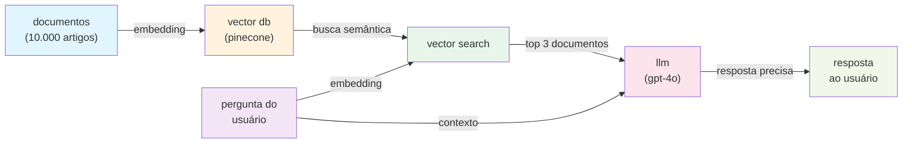

**como usar:**
1. **preparar documentos:** coletar artigos, dividir em chunks de 500 tokens, gerar embeddings
2. **indexar:** usar pinecone ou weaviate, armazenar embeddings + metadados
3. **buscar:** converter pergunta em embedding, buscar top 3 documentos similares
4. **melhorias:** usar reranking (bge-reranker-large) e query rewriting

**ferramentas:** langchain/llamaindex, pinecone/weaviate, openai api, langsmith

**benefício:** respostas precisas, reduz alucinações, conhecimento atualizado.

---

### exemplo 2: fine-tuning com lora

**caso de uso:** clínica médica quer modelo que classifique sintomas com precisão médica.

**problema:**
- gpt genérico confunde sintomas
- resposta: "pode ser gripe ou covid"
- não é confiável para diagnóstico

**solução com fine-tuning:**
1. coletar 5.000 exemplos de sintomas + diagnósticos corretos
2. treinar modelo com lora (eficiente)
3. modelo aprende padrões específicos
4. resposta: "baseado em seus sintomas, probabilidade 85% de bronquite viral"

**snippet de código (python + unsloth):**
```python
from unsloth import fastlanguagemodel
from trl import sfttrainer
from transformers import trainingarguments

model, tokenizer = fastlanguagemodel.from_pretrained(
    model_name = "unsloth/llama-3-8b-bnb-4bit",
    max_seq_length = 2048,
    load_in_4bit = true,
)

model = fastlanguagemodel.get_peft_model(
    model, r = 16, target_modules = ["q_proj", "k_proj", "v_proj", "o_proj"],
    lora_alpha = 16, lora_dropout = 0,
    use_gradient_checkpointing = true,
)

trainer = sfttrainer(
    model = model, tokenizer = tokenizer, train_dataset = dataset,
    dataset_text_field = "text", max_seq_length = 2048,
    args = trainingarguments(
        per_device_train_batch_size = 2, gradient_accumulation_steps = 4,
        max_steps = 60, learning_rate = 2e-4,
        fp16 = not torch.cuda.is_bf16_supported(),
        bf16 = torch.cuda.is_bf16_supported(), output_dir = "outputs",
    ),
)

trainer.train()
```

**arquitetura fine-tuning:**

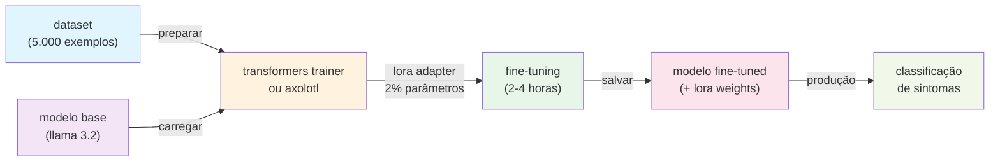

**como usar:**
1. **preparar dataset:** 5.000 exemplos (sintomas → diagnóstico), formato jsonl
2. **escolher framework:** transformers trainer, axolotl ou unsloth
3. **configurar lora:** rank 8-16, reduzir parâmetros em 99%
4. **treinar:** 2-4 horas em gpu
5. **deployar:** usar vllm ou tgi, latência <100ms

**ferramentas:** transformers trainer/axolotl, unsloth, trl, ragas, vllm

**benefício:** precisão especializada, confiável para domínio específico.

---

### exemplo 3: agentic rag com langgraph

**caso de uso:** responder: *"qual é a política de devolução para clientes que compraram há mais de 30 dias?"*

**problema:**
- rag simples busca por "devolução"
- retorna artigo genérico
- não responde a pergunta específica

**solução com agentic rag:**
1. agente recebe pergunta
2. pensa: "preciso de 2 informações: política geral + regras especiais"
3. executa 2 buscas diferentes
4. sintetiza: "política geral é 30 dias, mas há exceção se produto tiver defeito"

**snippet de código (python + langgraph):**
```python
from langgraph.graph import stategraph, end
from typing import typeddict, annotated

class agentstate(typeddict):
    question: str
    context: str
    answer: str

def retrieve(state):
    return {"context": "contexto recuperado"}

def generate(state):
    return {"answer": "resposta gerada"}

workflow = stategraph(agentstate)
workflow.add_node("retrieve", retrieve)
workflow.add_node("generate", generate)
workflow.set_entry_point("retrieve")
workflow.add_edge("retrieve", "generate")
workflow.add_edge("generate", end)

app = workflow.compile()
result = app.invoke({"question": "minha pergunta"})
```

**arquitetura agentic rag:**

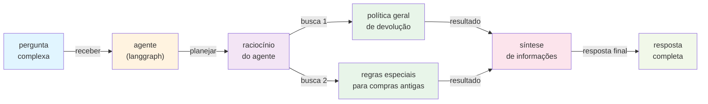

**ferramentas:** langgraph, langchain, pinecone/weaviate, langsmith

**benefício:** respostas mais precisas, raciocínio inteligente, menos alucinações.

---

### exemplo 4: vibecoding com cursor

**caso de uso:** desenvolver aplicação rag em 1 dia (vs 1 semana manualmente).

**problema:**
- desenvolvimento manual é lento
- muitos erros de digitação
- debugging consome tempo

**solução com vibecoding:**
1. abrir cursor
2. descrever: "crie um chatbot rag com langchain"
3. cursor gera código automaticamente
4. você revisa e ajusta
5. pronto em horas, não dias

**arquitetura vibecoding:**

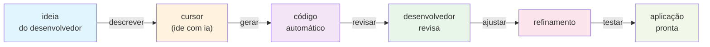

**ferramentas:** cursor, github copilot, claude api/openai api

**benefício:** desenvolvimento 5-10x mais rápido, menos erros.

---

### exemplo 5: no-code com dify

**caso de uso:** não-técnico quer criar chatbot rag sem escrever código.

**problema:**
- não sabe programar
- precisa de solução rápida
- orçamento limitado

**solução com dify:**
1. abrir dify
2. criar novo "application"
3. arrastar blocos: input → rag → llm → output
4. conectar blocos
5. publicar como api ou chatbot
6. pronto! sem uma linha de código

**arquitetura no-code ia:**

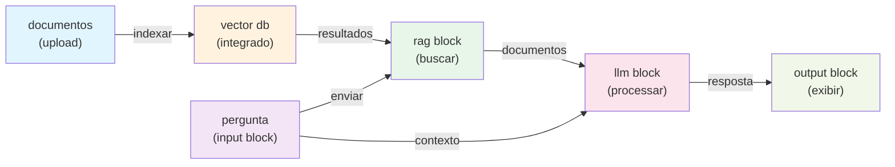

**ferramentas:** dify, openai api/claude api

**benefício:** não-técnicos constroem aplicações complexas, desenvolvimento rápido.

---

### exemplo 6: monitoramento de custos com helicone

**caso de uso:** empresa usa 10 apis de llm e quer rastrear gastos.

**problema:**
- múltiplas apis (openai, anthropic, google)
- difícil rastrear gastos
- sem visibilidade de custos por aplicação

**solução com helicone:**
1. integrar helicone em todas as apis
2. helicone intercepta requisições
3. rastreia: tokens, custo, latência, modelo
4. dashboard mostra gastos em tempo real
5. alertas quando gastos excedem limite

**snippet de código (python + helicone):**
```python
from openai import openai

client = openai(
    api_key="sk-...",
    base_url="https://oai.hconeai.com/v1",
    default_headers={"helicone-auth": "bearer sk-helicone-..."}
)

response = client.chat.completions.create(
    model="gpt-4o",
    messages=[{"role": "user", "content": "olá!"}],
    user="user-123"
)
```

**arquitetura de observabilidade:**

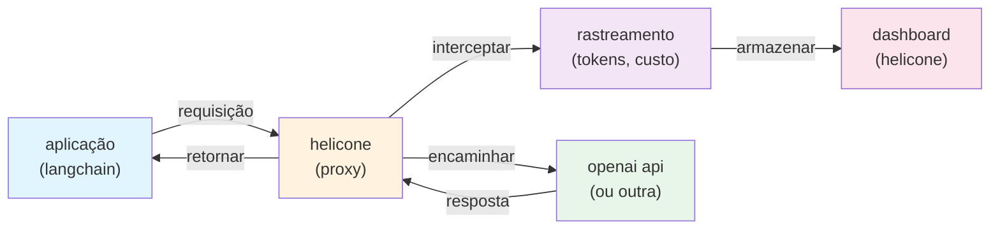

**ferramentas:** helicone, openai api/anthropic api, langchain

**benefício:** visibilidade de custos, otimização de gastos, alertas automáticos.

---

### exemplo 7: agente whatsapp com human-in-the-loop (langgraph)

**caso de uso:** atendimento ao cliente via whatsapp onde o bot resolve dúvidas simples, mas deve passar para um humano se detectar irritação ou solicitação complexa.

**problema:**
- chatbots tradicionais ficam em "loop infinito" quando não sabem a resposta.
- clientes ficam frustrados sem opção de falar com uma pessoa.
- perda de contexto na transição bot → humano.

**solução com langgraph:**
1. **estado persistente:** o histórico da conversa é salvo num banco (postgres/redis).
2. **análise de sentimento:** cada mensagem passa por um nó de análise.
3. **interrupção (breakpoint):** se `sentimento < 0.3` ou `intent == "falar_humano"`, o grafo "pausa".
4. **handoff:** o sistema notifica o humano (via slack/zendesk).
5. **retomada:** o humano responde, e o grafo é "resumido" com a nova resposta, mantendo o fluxo.

**snippet de código (python + langgraph):**
```python
from langgraph.graph import stategraph, end
from langgraph.checkpoint.memory import memorysaver

# definir estado
class state(typeddict):
    messages: list
    sentiment: float
    handoff: bool

def chatbot(state):
    # lógica do llm aqui...
    return {"messages": [response]}

def sentiment_analyzer(state):
    score = analyze(state["messages"][-1])
    return {"sentiment": score}

def router(state):
    if state["sentiment"] < 0.3 or state.get("handoff"):
        return "human_node"
    return end

workflow = stategraph(state)
workflow.add_node("chatbot", chatbot)
workflow.add_node("analyze", sentiment_analyzer)
workflow.add_node("human_node", human_alert_function) # nó de interrupção

workflow.set_entry_point("chatbot")
workflow.add_edge("chatbot", "analyze")
workflow.add_conditional_edges("analyze", router)

# checkpointer para persistência (human-in-the-loop)
memory = memorysaver()
app = workflow.compile(checkpointer=memory, interrupt_before=["human_node"])
```

**arquitetura handoff:**

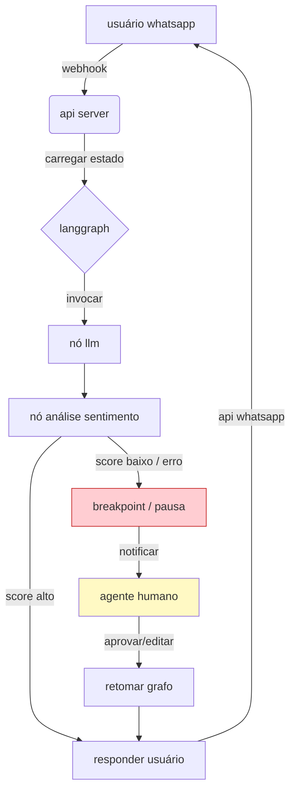

**ferramentas:** langgraph (orquestração), twilio/meta api (whatsapp), redis (memória), fastapi.

**benefício:** experiência de usuário fluida, resolução garantida (ia ou humana), histórico unificado.

---

### exemplo 8: extração de dados estruturados (idp)

**caso de uso:** automatizar o processamento de milhares de notas fiscais (pdfs) e inserir os dados no erp.

**problema:**
- ocr tradicional falha com layouts variados.
- regex é frágil e difícil de manter.
- dados não estruturados geram erros no banco de dados.

**solução com instructor + pydantic:**
1. o llm (gpt-4o/claude 3.5) "vê" o documento como imagem.
2. usamos `pydantic` para definir o **schema exato** esperado (json schema).
3. a biblioteca `instructor` força o llm a retornar *apenas* json válido que obedeça ao schema.
4. validação automática: se o llm alucinar um campo, o framework faz o "retry" automaticamente corrigindo o erro.

**snippet de código (python + instructor):**
```python
import instructor
from pydantic import basemodel
from openai import openai

class invoiceitem(basemodel):
    description: str
    quantity: int
    unit_price: float

class invoice(basemodel):
    invoice_number: str
    date: str
    items: list[invoiceitem]
    total: float

# patch openai para usar instructor
client = instructor.from_openai(openai())

# extrair dados estruturados
invoice = client.chat.completions.create(
    model="gpt-4o",
    response_model=invoice,
    messages=[
        {
            "role": "user", 
            "content": [
                {"type": "text", "text": "extraia os dados desta nota fiscal:"},
                {"type": "image_url", "image_url": {"url": "https://exemplo.com/nf.pdf"}}
            ]
        }
    ]
)

print(invoice.model_dump_json(indent=2))
```

**arquitetura extração estruturada:**

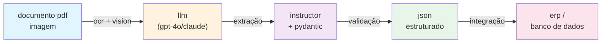

**ferramentas:** instructor, pydantic, openai/claude api, ocr (tesseract/adobe).

**benefício:** extração precisa, validação automática, integração direta com sistemas.

---

### exemplo 9: multi-agent orchestration (crewai + langgraph)

**caso de uso:** equipe de conteúdo quer automatizar pesquisa, escrita e revisão de artigos técnicos.

**problema:**
- pesquisa manual consome horas por artigo
- inconsistência de qualidade entre escritores
- revisão demorada e subjetiva

**solução com multi-agent:**
1. pesquisador busca fontes atualizadas na web
2. redator escreve rascunho baseado na pesquisa
3. revisor analisa qualidade e sugere melhorias
4. ciclo continua até aprovação

**arquitetura multi-agent:**

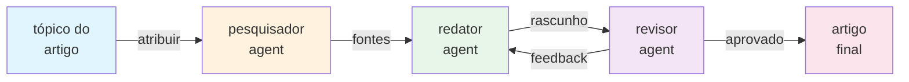

**como usar:**
1. **definir tarefa:** especificar tópico e requisitos do artigo
2. **configurar agentes:** criar agentes especializados com roles claros
3. **definir workflow:** estabelecer sequência e critérios de aprovação
4. **executar:** iniciar orquestração e monitorar progresso
5. **revisar:** aprovar ou solicitar iterações no artigo final

**ferramentas:** crewai, langgraph, tavily api, openai/claude api.

**benefício:** automação completa do workflow editorial, qualidade consistente.

---

### exemplo 10: rag híbrido (vector + graph + keyword)

**caso de uso:** empresa quer sistema de busca que combine semântica, relacionamentos e palavras-chave exatas.

**problema:**
- busca vetorial não encontra termos específicos
- busca por palavras-chave não entende contexto
- knowledge graph sozinho é limitado

**solução com rag híbrido:**
1. indexar documentos em múltiplos formatos simultaneamente
2. executar busca paralela em todos os índices
3. combinar e reranquear resultados
4. enviar top k documentos mais relevantes para o llm

**arquitetura rag híbrido:**

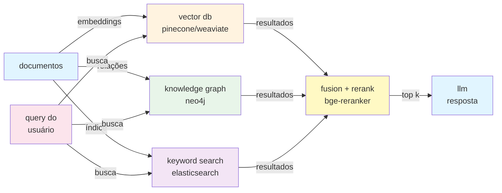

**como usar:**
1. **indexar documentos:** criar embeddings no vector db
2. **construir knowledge graph:** extrair entidades e relações para neo4j
3. **configurar keyword search:** indexar no elasticsearch
4. **implementar fusion:** combinar scores dos três métodos
5. **adicionar reranking:** usar cross-encoder para ordenar final

**ferramentas:** llamaindex, neo4j, elasticsearch, bge-reranker.

**benefício:** melhor recall e precisão, cobertura completa do conhecimento.

---

### exemplo 11: real-time rag com websockets

**caso de uso:** chatbot que responde em tempo real com streaming de tokens e busca simultânea.

**problema:**
- usuários esperam respostas imediatas
- busca síncrona aumenta latência percebida
- experiência de "digitação" melhora engajamento

**solução com real-time rag:**
1. estabelecer conexão websocket persistente
2. buscar documentos em paralelo com geração
3. stream tokens conforme são gerados
4. exibir resposta progressivamente ao usuário

**snippet de código (python + fastapi + websockets):**
```python
from fastapi import fastapi, websocket
from langchain.chains import retrievalqa

app = fastapi()

@app.websocket("/ws/chat")
async def websocket_endpoint(websocket: websocket):
    await websocket.accept()
    while true:
        query = await websocket.receive_text()
        # busca paralela
        docs = await retriever.aget_relevant_documents(query)
        # streaming de resposta
        async for token in chain.astream({"query": query, "context": docs}):
            await websocket.send_text(token)
```

**arquitetura real-time rag:**

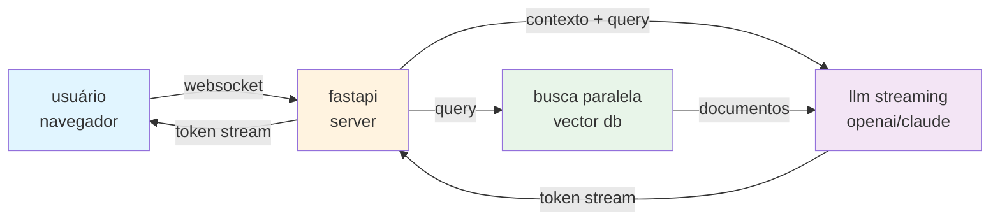

**como usar:**
1. **configurar websocket:** implementar endpoint com fastapi
2. **implementar retriever:** buscar documentos de forma assíncrona
3. **habilitar streaming:** usar `astream` em vez de `ainvoke`
4. **gerenciar estado:** manter histórico da conversa no redis
5. **tratar reconexões:** implementar lógica de retry e reconexão

**ferramentas:** fastapi, websockets, langchain, redis.

**benefício:** experiência de usuário instantânea, percepção de velocidade.

---

## 5. segurança e governança

| tópico                               | descrição                                   | ferramentas/práticas                                      |
| ------------------------------------ | ------------------------------------------- | --------------------------------------------------------- |
| proteção contra prompt injection     | prevenir manipulação maliciosa de prompts   | input validation, prompt hardening, output filtering      |
| controle de acesso baseado em rbac   | limitar acesso a recursos sensíveis         | role-based access control, oauth2, jwt                    |
| detecção de dados sensíveis (pii)    | identificar e proteger informações pessoais | presidio, amazon macie, microsoft purview                 |
| compliance (gdpr, lgpd, ai act)      | conformidade com regulamentações            | data retention policies, consent management, audit trails |
| red teaming                          | testes de segurança ofensivos               | adversarial testing, automated vulnerability scanning     |
| fairness e bias detection            | detectar e mitigar vieses nos modelos       | fairlearn, what-if tool, aequitas                         |
| interpretabilidade e explicabilidade | entender decisões do modelo                 | shap, lime, attention visualization                       |
| guardrails                           | limitar comportamento do modelo             | guardrails ai, llamaguard, nebula guardrails              |
| versionamento de modelos             | rastrear versões e mudanças                 | mlflow, dvc, weights & biases                             |
| backup e disaster recovery           | recuperação em caso de falha                | multi-region deployment, automated backups                |

---

## 6. metodologia e fontes

### abordagem de curadoria

este documento é atualizado trimestralmente com base em:

- análise de tendências no github, arxiv e papers with code
- benchmarks oficiais (lmsys arena, hugging face leaderboards)
- feedback da comunidade e casos de uso reais
- releases oficiais de empresas e frameworks

### camadas de atualização

| camada           | frequência | conteúdo                                                            |
| ---------------- | ---------- | ------------------------------------------------------------------- |
| **core**         | semestral  | conceitos fundamentais estáveis; ferramentas maduras                |
| **expansion**    | trimestral | ferramentas emergentes; modelos top-tier; técnicas state-of-the-art |
| **experimental** | mensal     | lançamentos recentes (< 3 meses); projetos em alpha/beta            |

### fontes principais

- [github trending](https://github.com/trending)
- [papers with code](https://paperswithcode.com/)
- [hugging face hub](https://huggingface.co/)
- [lmsys chatbot arena](https://chat.lmsys.org/)
- [arxiv](https://arxiv.org/)
- [thoughtworks technology radar](https://www.thoughtworks.com/radar)
- [state of ai report](https://www.stateof.ai/)

---

*última atualização: fevereiro 2026*
